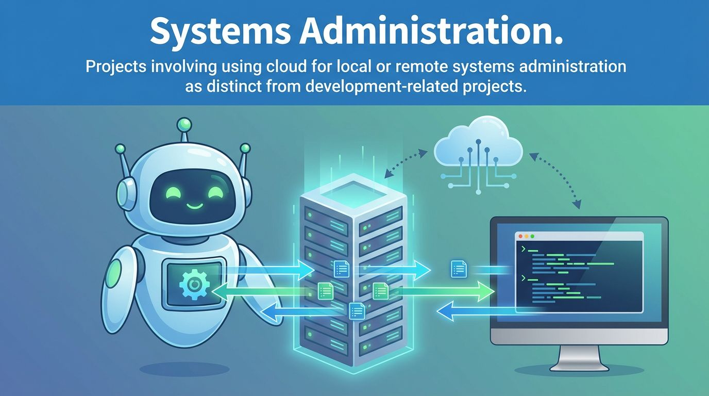
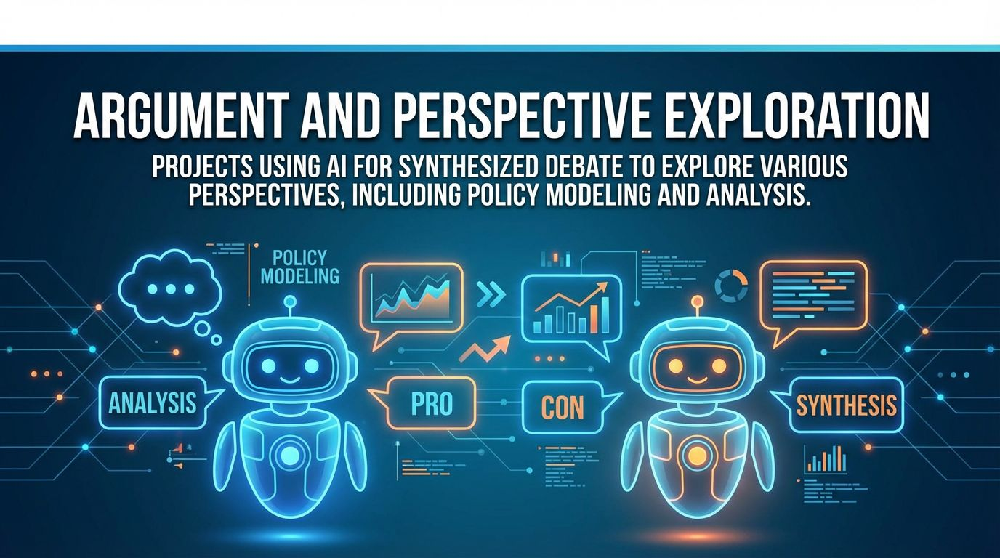
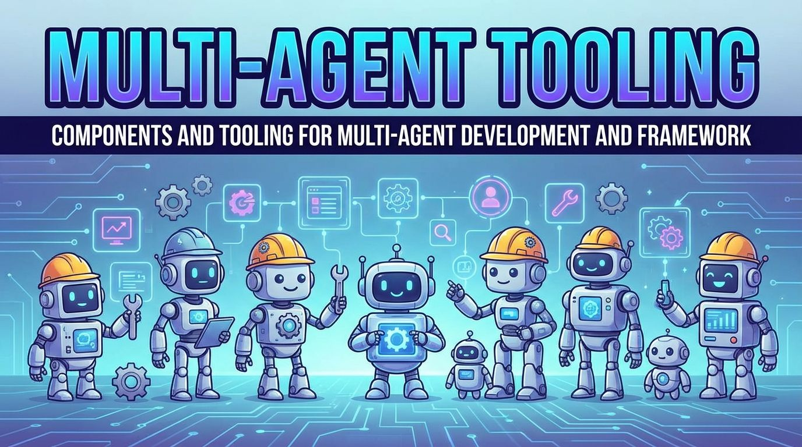
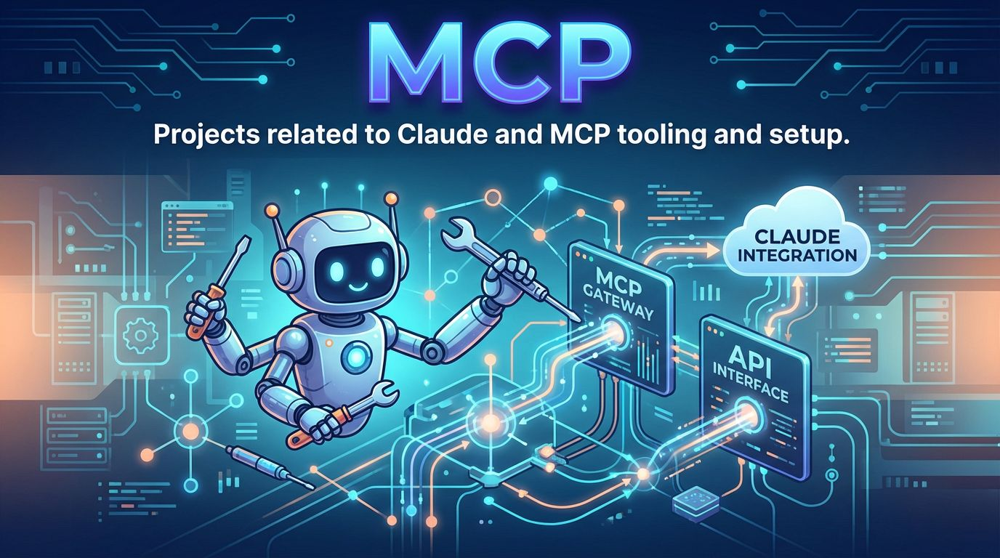
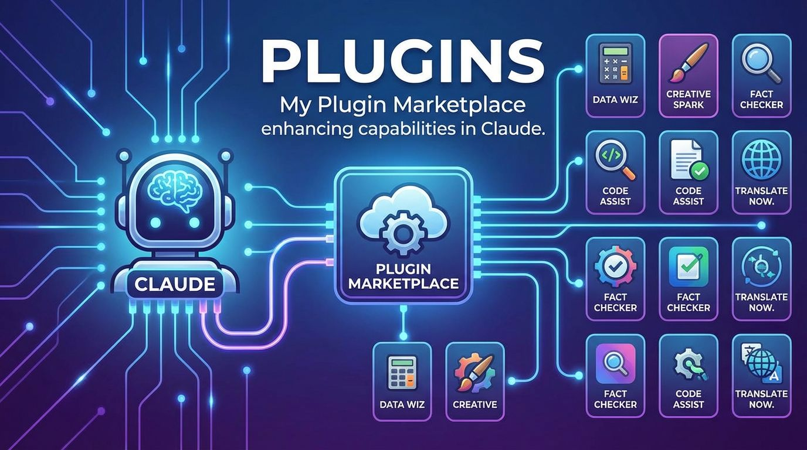
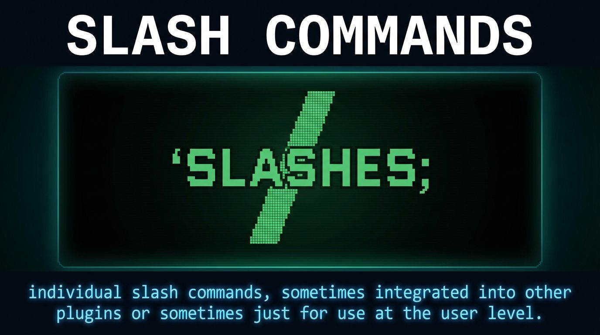

## Repository Growth

---

My Claude Code related repositories, by section.

Most patterns/templates/models are adaptable to other agentic AI CLIs (and frameworks).

For the Claude Space idea, see [Claude Spaces](./claude-spaces.md)

For notes on templates and workspaces, see [Notes](./notes.md)

---

Projects involving using Claude for local or remote systems administration as distinct from development-related projects.

### Claude Code LAN Manager
 

Claude Workspace for managing multiple computers on a local network, providing centralized administration of LAN-connected machines through Claude Code with network-wide configuration, monitoring, and maintenance capabilities.

---

### Claude Code Linux Desktop Slash Commands

System administration and configuration slash commands specifically designed for Linux desktop environments.

---

### Claude Code Security Auditor
 

Comprehensive system for managing and auditing security configurations across multiple machines, performing systematic security checks including antivirus status, rootkits, file permissions, and network exposure.

---

### Claude Conda Manager
 

Specialized Claude Code workspace for managing and optimizing Conda environments on Ubuntu workstations with AMD ROCm hardware, designed to maintain efficient AI/ML development environments through systematic documentation and version control.

---

### Claude Docker Manager
  

Claude Code workspace template for managing Docker environments with pre-built slash commands and specialized subagents. Features commands for environment setup, health monitoring, cleanup, log analysis, deployment, and backups. Includes diagnostic agents for container issues, compose file generation, security auditing, migration planning, and resource optimization. Supports local and remote Docker environments with organized context storage for persistent environment state.

---

### Claude Home Assistant Manager Template
  

Customizable template for managing Home Assistant OS through Claude Code with 20+ slash commands covering health monitoring, backups, network diagnostics, and maintenance operations, plus 5 specialized agents for automation, integration, device, backup, and troubleshooting workflows.

---

### Claude Linux Desktop Manager
  

AI-powered system administration interface wrapping Claude Code CLI with a graphical interface for executing Linux desktop management tasks, integrating an extensive library of slash commands for system configuration, diagnostics, hardware benchmarking, security auditing, and network operations.

---

### Claude OS Sync Agent
 

Intelligent synchronization tool for maintaining consistency between desktop and laptop using Claude CLI for context-aware decisions about packages, configurations, and tools with hardware-aware installation recommendations.

---

### Claude Proxmox Manager Template
  

Customizable template for Proxmox server management with 38 slash commands and 10 specialized agents supporting Docker, networking, security, backups, and hardware monitoring on low-spec hardware.

---

### Claude Rescue

Concept for using Claude Code as an emergency Linux system recovery tool, providing a quick-install bash script that deploys Claude Code with elevated permissions into recovery shell environments to diagnose and fix boot issues, driver problems, and system failures with AI-assisted troubleshooting.

---

### Claude Server Manager Template
  

Template repository for configuring Claude Code as a comprehensive server administration tool with 38 slash commands for routine system administration tasks and 10 specialized agents for complex management workflows, optimized for Docker deployments, backup management, and low-spec hardware monitoring on Ubuntu servers.

---

### Claude Server Mgmt Template SBCs
  

Template for managing Ubuntu servers on Single Board Computers (SBCs) with 38 slash commands for system administration and 10 specialized agents, designed for Docker deployments, backups, and local network services on resource-constrained hardware.

---

### Claude Synology Manager
  

Template workspace for managing Synology NAS devices through Claude Code with SSH and MCP integration. Features persistent context storage for NAS configuration, volume snapshots, and mount configurations, enabling conversational management of shared folders, storage monitoring, backup operations, and NFS/SAMBA mount configuration.

---

### Claude System Recovery Mode

Custom GRUB boot entry integrating Claude CLI into Linux system recovery, enabling AI-assisted system recovery with pre-configured agents and commands for diagnostics and remediation tasks.

---

### Linux Desktop ClaudeMD Seeder

Automatically generates and deploys contextual CLAUDE.md files across a Linux desktop filesystem to improve Claude Code's understanding of directory structures and workflows.

---

Projects using Claude Code for non-development and technology-related projects, including organization, personal productivity, and specialized domain applications.

### Claude ADB Workspace Template
 

Version-controlled workspace template for managing Android devices through ADB with Claude Code. Features automated device profiling, package management with timestamped exports, bloatware removal, system diagnostics, and forensic logging. Includes specialized agents for device optimization and package analysis, with structured directories for manifests, package lists, and diagnostic logs.

---

### Claude ADHD Research Workspace
 

Research repository documenting systemic barriers preventing ADHD patients from accessing prescribed medications, gathering research, personal narratives, and advocacy materials to propose policy reforms balancing regulatory oversight with patient welfare.

---

### Claude Blog Manager
 

Conversational blog management workspace for Claude Code enabling API-first content publishing workflows. Template repository for managing blog content through headless CMS platforms using MCP integrations, featuring dedicated directories for drafting and published content, with specialized commands for content creation, proofreading, and automated publishing while preserving authorial voice.

---

### Claude Budget Workspace Template
 

Template for managing household budgets using Claude Code, providing structured workspace framework for financial planning and budget analysis tasks.

---

### Claude Code Writing Squad

Multi-agent writing system designed to iteratively process and refine text through specialized editing agents, including typo review, UK English standardization, flow improvement, heading creation, proofreading, source addition, and SEO optimization.

---

### Claude Decision Evaluation Framework
 

Structured system for analyzing major life and business decisions through seven parallel analytical frameworks using Claude Code. Evaluates decisions via Cost-Benefit Analysis, SWOT, Decision Matrix, ICE Framework, Risk-Reward Assessment, Eisenhower Matrix, and Regret Minimization, producing comprehensive reports with objective 0-100 scores without averaging to help users examine choices from multiple perspectives.

---

### Claude Diary Planner Template
 

Forkable template for workflow and time management planning with Claude Code, providing a foundation for organizing daily schedules and productivity workflows.

---

### Claude Health Helper
 

Organized workspace for managing personal health documentation with AI assistance. Helps users convert medical visit transcripts into structured summaries, prepare symptom lists for doctor visits, document medications and conditions, and generate layperson-friendly summaries of medical reports. Features structured directories for consultations, imaging, test results, visit preparation, and medication references.

---

### Claude Job Search Strategist
 

Structured workspace for orchestrating Claude sub-agents during a job search process. Features specialized agents for company research, compensation analysis, resume tailoring, cover letter generation, interview preparation, and career strategy. Includes organized directories for user context, application tracking, and generated outputs with slash command conventions for streamlined workflows.

---

### Claude Rig Planner
 

Structured workspace template for planning computer hardware upgrades with Claude Code. Supports gaming PCs, workstations, homelab servers, or multiple machines with features for context gathering, hardware profiling, multi-machine planning, formal VAT-compliant estimates, and currency localization. Includes slash commands for setup, profiling, analysis, recommendations, and estimates.

---

### Claude Therapy Tracker
 

Template repository structure for organizing and tracking therapy sessions, mental health goals, and therapeutic planning through version-controlled documentation, featuring separated directories for human input and AI outputs with specialized agents and slash commands for session planning and goal tracking.

---

### Claude Website Update Sender

Automated workflow for sending polished update emails to colleagues about website changes and deployments, transforming technical commit messages or freeform notes into non-technical updates via Resend MCP with HTML templating and human-in-the-loop review.

---

### Claude Writing Space Template
 

Structured workspace template for writing projects using Claude Code, designed to preserve authorial voice while providing systematic version control and editing workflows. Features sequential versioning, specialized proofreading and editing agents, archive management, and support for headless CMS publishing with organized directories for drafts, research, notes, and images.

---

### Declaude

Customizable system for creating personalized text rewriting rules that consolidate into a Claude Code slash command to refine AI-generated technical documentation. Features modular rule management, vocabulary avoidance lists, LLM-powered consolidation, and versioned outputs for maintaining consistent writing style.

---

### Non-Code Claude Code

Showcase of creative applications of Claude Code beyond traditional software development, including deep research, writing, learning, and finance use cases.

---

Projects using Claude and agentic systems for deep research, report generation, and information synthesis.

### Claude ADHD Research Workspace
 

Research repository documenting systemic barriers preventing ADHD patients from accessing prescribed medications, gathering research, personal narratives, and advocacy materials to propose policy reforms balancing regulatory oversight with patient welfare.

---

### Claude Deep Research Model

Framework for conducting iterative deep research using Claude with integrated voice pipeline component, featuring organized research workflows with dedicated sections for prompts, context management, and structured outputs.

---

### Claude Deep Research Template
 

Structured workflow system for conducting systematic, comprehensive research using Claude Code with specialized research agents, organized directory structure for context and prompts, and support for iterative investigations across academic, market, technical, and strategic research domains.

---

### Claude News Fetcher - Media Monitoring System
 

Comprehensive workspace for conducting media monitoring and gathering articles into a well-defined structured data format. Features date-based article organization, JSON schema validation, specialized agents for article fetching and analysis, and extensive slash commands for batch processing, search, validation, and export workflows.

---

### Claude Stack Research Workspace

Structured environment for conducting technical research and evaluating software solutions using Claude Code, organizing research requests, findings, and recommendations through dedicated directories, custom commands, and specialized AI agents to streamline technology stack comparisons and component evaluations.

---

### Claude Tech Research Team

Multi-agent system for conducting comprehensive software and hardware technology evaluations, orchestrating specialized AI agents for SaaS discovery, open-source alternatives, compatibility assessment, geographic sourcing, and automated report generation with MCP integrations.

---

### Ecosystem Mapper

Experimental AI agent that automatically discovers, categorizes, and visualizes technology ecosystems based on keyword searches. Searches GitHub and the web for recent projects, analyzes the landscape using Gemini AI to create a taxonomy, identifies representative examples, and generates visual ecosystem maps showing relationships and groupings.

---

Projects using AI for synthesized debate to explore various perspectives, including policy modeling and analysis.

### Claude Change My View
 

Structured workspace for challenging personal beliefs through AI-assisted critical analysis, inspired by the r/ChangeMyView subreddit. Features organized workflow for documenting viewpoints, running specialized agents to generate counterarguments and rebuttals, and tracking outcomes with slash commands for initiating challenges and subagents for argument generation and podcast creation.

---

### Claude Think Tank
 

Template framework for building a virtual think tank using AI agents, enabling research assistance and policy proposal development through collaborative Claude Code agents that synthesize information and generate policy ideas with organized file management and specialized slash commands.

---

### Panel Of Claude

Multi-agent system simulating expert panel discussions using multiple Claude agents with different analytical perspectives (economic, ethical, scientific, political, etc.) to provide comprehensive, multi-dimensional analysis through two-round cross-perspective refinement with outputs in JSON, markdown, PDF, ePub, and podcast-ready audio formats.

---

Projects exploring using Claude and related tooling for personalized user engagement, including through RAG, interviewing methods, and context injection.

### Claude Code Context Toolkit

Implements the CONTEXT.md workflow system bridging human-friendly context documentation with AI-optimized briefings through slash commands and specialized agents for managing, converting, and synchronizing project context between narrative CONTEXT.md files and structured CLAUDE.md briefings.

---

### Claude Code Repo Managers ClaudeMD

Pre-configured CLAUDE.md templates providing context-aware instructions for managing different repository types including Hugging Face projects, GitHub repositories, and collaborative workspaces.

---

### Claude Spec Starter
 

Template repository that transforms unstructured project descriptions into organized specifications and context files for Claude Code projects, automating the conversion of free-form prompts into structured technical specs through a `/build-repo` slash command.

---

### CONTEXT.md

Workflow methodology for preparing project context in human-friendly markdown files that can be converted into agent-specific configuration files, separating casual human-authored CONTEXT.md scratchpads from structured CLAUDE.md briefings for AI agents.

---

### Linux Desktop ClaudeMD Seeder

Automatically generates and deploys contextual CLAUDE.md files across a Linux desktop filesystem to improve Claude Code's understanding of directory structures and workflows.

---

### Make Agent Friendly

Claude Code plugin that prepares human-developed codebases for agentic development by analyzing structure, asking clarifying questions, restructuring folders for agent navigability, creating CLAUDE.md documentation and /context/ directories, and validating changes before committing.

---

### Private And Public Claude MD

Tools for managing both public CLAUDE.md and private CLAUDE_PRIVATE.md configuration files with security-focused git configuration to prevent accidental exposure of sensitive information.

---

Components and tooling for multi-agent development and framework.

### Claude Agent Picker Pattern

Conceptual framework for intelligently assembling context-optimized multi-agent crews by evaluating project requirements, selecting complementary subagents with minimal overlap, and automatically generating crew configurations that stay within context window limits.

---

### Claude Code Linux Notes

Personal documentation repository containing practical workflows, configurations, and tips for using Claude Code on Ubuntu with KDE Plasma, covering Linux-specific integration, system automation, and real-world usage patterns.

---

### Claude Code Notebook

Minimal personal reference repository for documenting and organizing usage patterns, workflows, and notes related to Claude Code.

---

### Claude Development Agents

Curated toolkit of Claude Code configurations for development workflows, organizing sub-agents, slash commands, snippets, orchestrators, and crews into a five-category taxonomy with 74+ configurations covering code editing, deployment, debugging, web development, and multi-agent coordination.

---

### Claude Sub-Agent Network

Collection of ready-to-use system prompts and configurations for various development, operational, and creative tasks, organized into prompts-only and frontmatter-enhanced formats for multi-agent development workflows.

---

### Claude Task Manager

Planning repository for a sequential task queuing system for Claude Code and other agentic AI coding tools. Addresses context window exhaustion and manual task handoff friction through a queue that accepts freeform/voice input, parses it into discrete tasks, prioritizes fixes over features automatically, and executes tasks one at a time with fresh context.

---

### Claude Workspace Setup Helper

Interactive tool for setting up Claude Workspaces - pre-configured repository templates for various use cases. Features a catalog of workspace templates organized by category (environment management, content creation, research, health & wellness, career) with an interactive `/start` command that helps users discover, select, and clone workspaces based on their objectives.

---

### Cool Claude Code Stuff

Curated collection of Claude Code projects, tools, and resources organized by category including account management, ACP integration, actions, agent managers, API providers, automation tools, and autonomy enhancers.

---

### Panel Of Claude

Multi-agent system simulating expert panel discussions using multiple Claude agents with different analytical perspectives (economic, ethical, scientific, political, etc.) to provide comprehensive, multi-dimensional analysis through two-round cross-perspective refinement with outputs in JSON, markdown, PDF, ePub, and podcast-ready audio formats.

---

Projects related to Claude and MCP tooling and setup.

### Claude Code MCP Command Generator

Generator for creating MCP commands for use with Claude Code.

---

### Claude Code MCP List

Curated index of Model Context Protocol servers organized into 14+ categories including AI model integration, memory management, code analysis, development tools, browser automation, and workflow automation for extending Claude Code capabilities.

---

### Claude MCP Guidelines

Guideline snippet for adding determinative guidance to Claude Code on how to use MCPs encountered across environments, providing context for MCP selection and usage patterns to resolve ambiguities between MCPs and internal Claude tools.

---

### MCPM Claude Code Docs

Documentation for integrating Claude Code with MCPM (an external MCP server manager). Provides guidance on managing Model Context Protocol tools across user, project, and local scopes while avoiding conflicts between Claude's native MCP features and external management tools.

---

### Smithery Claude Code MCP Jumpstarter

Curated collection of 35+ MCP servers across 15+ categories with interactive installer for streamlining installation and configuration, including essentials bundle for core functionality.

---

My Plugin Marketplace enhancing capabilities in Claude.

### Claude Code Context Toolkit

Implements the CONTEXT.md workflow system bridging human-friendly context documentation with AI-optimized briefings through slash commands and specialized agents for managing, converting, and synchronizing project context between narrative CONTEXT.md files and structured CLAUDE.md briefings.

---

### Claude Code Plugins Marketplace

Centralized marketplace and registry for discovering and installing Claude Code plugins. Add the marketplace with `/plugin marketplace add` and browse categorized plugins spanning AI tools, development utilities, system administration, media management, and more—each installable via simple commands.

---

### Claude Janitor

Claude plugin for cleaning up repositories by removing Claude-related artifacts and configurations. Includes plugin configuration files, prompts, and documentation for integrating cleanup functionality into Claude workflows.

---

### Make Agent Friendly

Claude Code plugin that prepares human-developed codebases for agentic development by analyzing structure, asking clarifying questions, restructuring folders for agent navigability, creating CLAUDE.md documentation and /context/ directories, and validating changes before committing.

---

### User Manual Plugin

Claude Code plugin for generating personal user manuals and private documentation for codebases. Creates personalized, private reference guides with PDF output support, featuring step-by-step workflow commands for documentation setup, section generation, PDF compilation, and version-controlled distribution via MCP integrations.

---

Individual slash commands, sometimes integrated into other plugins or sometimes just for use at the user level.

### AI-Human Attribution Adder

Automates the addition of attribution sections to README files, enabling developers to transparently document which parts of a project were human-created versus AI-assisted for ethical representation of AI tool usage.

---

### Claude App Optimiser

Slash command (`/optimise`) deploying "Turbo Claude 5000," a specialized sub-agent for analyzing and improving codebases through dead code removal, architectural evaluation, and database optimization.

---

### Claude Code Linux Desktop Slash Commands

System administration and configuration slash commands specifically designed for Linux desktop environments.

---

### Claude Document This

Collection of methods and example slash commands for documenting system administration changes and fixes made by Claude Code, including MCP-based workflows (Notion, email, Google Drive) and Obsidian notebook integration for long-term reference retention.

---

### Claude File Organiser Super Slash

Comprehensive slash command that transforms disorganized filesystems into well-structured directories through intelligent pattern recognition, applying machine-readable naming conventions, detecting domain-specific organizational patterns, and autonomously fixing typos while managing cross-platform compatibility.

---

### Claude Slash Commands

General-purpose slash command library for various Claude Code workflows and tasks.

---

### No Wheel Inventions

Slash commands and agents encouraging developers to leverage existing libraries, components, and templates rather than building custom solutions. Includes five slash commands for prevention and remediation plus a stack-integration agent for identifying open-source opportunities.

---

Other projects that don't fit into one of the top categories.

### Bash Alias Manager Claude

Claude Code-powered tool for systematic management of bash aliases with features for adding, editing, deleting, researching, and backing up aliases with automatic YADM synchronization.

---

### Claude Code Bash Aliases

Collection of documented bash aliases for speeding up common and repetitive operations with Claude Code on Linux, including quick navigation to configuration directories, shortcuts for creating slash commands and agents, and MCP server management helpers.

---

### Claude Code Context Feature Requests

Feature requests and suggestions for improving Claude Code's context handling capabilities.

---

### Claude Github Shortlister
 

Template repository that helps developers systematically evaluate and shortlist GitHub repositories using Claude Code for automated analysis with structured workflow for repository collection, requirements definition, and AI-powered recommendations organized by star count, update date, and relevance.

---

### Claude Is Awesome
 

Template for streamlining creation of curated resource lists featuring automated formatting, alphabetization, and badge generation through custom slash commands to help users focus on meaningful curation rather than formatting tasks.

---

### Claude Model Identifier

Prompt template for verifying interaction with the correct Claude model variant at conversation start. Can be deployed as a home folder file or slash command for model authentication purposes.
