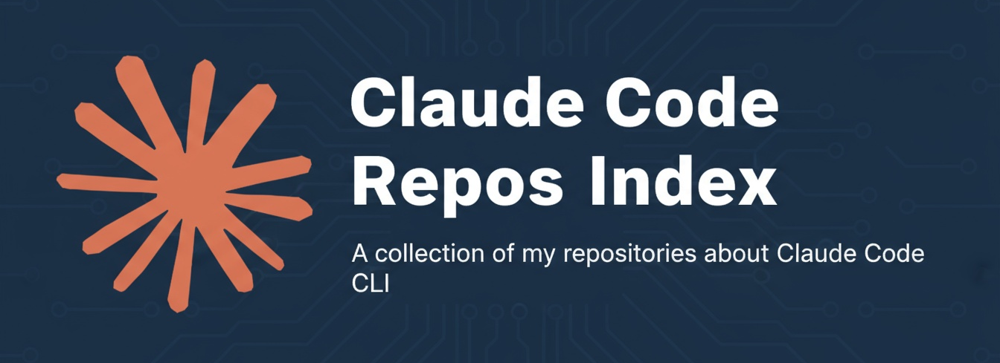
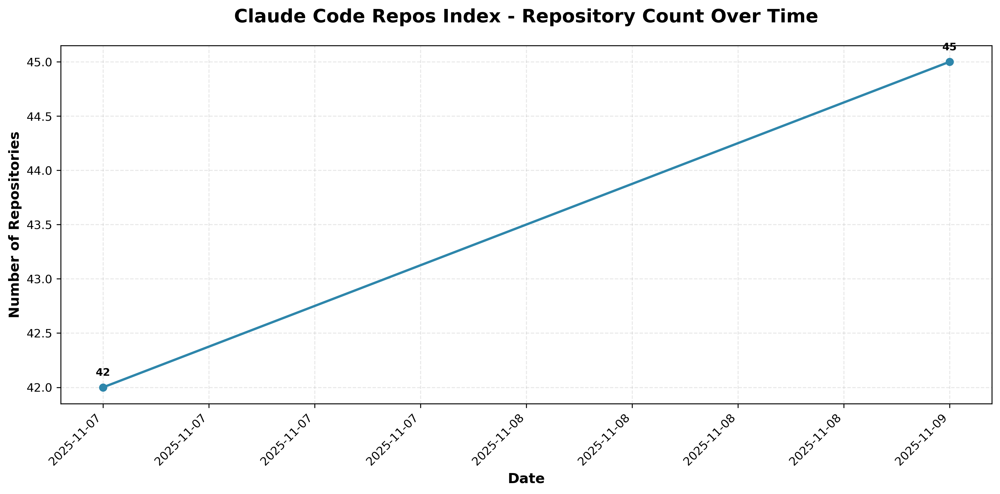

## Repository Growth

---

My Claude Code related repositories, by section. 

 Most patterns/templates/models are adaptable to other agentic AI CLIs (and frameworks).

 For the Claude Space idea, see [Claude Spaces](./claude-spaces.md)

 ---

## Beyond Code Generation: Templates & Workspaces

While Claude Code excels at software development, a significant portion of these repositories explore **template-driven workflows** for system administration, personal productivity, research, and domain-specific applications. These templates demonstrate that agentic IDEs are powerful frameworks for **any structured, iterative work** - not just coding.

### Understanding Templates

**Templates** in this context are fully-configured repository patterns you can fork and customize for your own use. Each template includes:

- **Pre-configured CLAUDE.md**: Context and instructions tailored to the domain
- **Slash command libraries**: Ready-to-use commands for common tasks
- **Specialized agents**: Domain-specific subagents for complex workflows
- **Directory structures**: Organized folders for inputs, outputs, context, and memory
- **Workflow documentation**: Guidance on using the template effectively

Templates are marked with the  badge and are designed to be **immediately usable** after forking.

### Claude Workspaces

A subset of templates I call **"Claude Workspaces"** (or **"Claude Spaces"**) focus specifically on **system administration and infrastructure management** - essentially using Claude Code as a **Conversational UI Agent (CUA)** for managing computers, networks, and services.

Workspace characteristics:
- **System-focused**: Designed for OS, network, or infrastructure management
- **Administration tasks**: Monitoring, configuration, diagnostics, security
- **Persistent state**: Organized storage for logs, configs, and documentation
- **Remote & local**: Can manage the local machine or remote systems via SSH

Repositories following this pattern are marked with the  badge.

**Why this matters**: These templates prove that Claude Code (and similar tools) transcend traditional software development. They're **general-purpose structured workflow engines** applicable to research, personal organization, financial planning, health tracking, and more. If your work involves iterative tasks, context management, and structured outputs, these templates demonstrate viable patterns.

---

# Repo Index, By Section

---

# Agent Systems & Multi-Agent Workflows

Multi-agent systems and orchestration frameworks that enable specialized agents to collaborate on complex tasks through iterative refinement and role-based processing.

## Claude Agent Picker Pattern

Conceptual framework for intelligently assembling context-optimized multi-agent crews by evaluating project requirements, selecting complementary subagents with minimal overlap, and automatically generating crew configurations that stay within context window limits.

---

## Claude Deep Research Model

Framework for conducting iterative deep research using Claude with integrated voice pipeline component, featuring organized research workflows with dedicated sections for prompts, context management, and structured outputs.

---

## Claude Deep Research Template
 

Structured workflow system for conducting systematic, comprehensive research using Claude Code with specialized research agents, organized directory structure for context and prompts, and support for iterative investigations across academic, market, technical, and strategic research domains.

---

## Claude Stack Research Workspace

Structured environment for conducting technical research and evaluating software solutions using Claude Code, organizing research requests, findings, and recommendations through dedicated directories, custom commands, and specialized AI agents to streamline technology stack comparisons and component evaluations.

---

## Claude Code Writing Squad

Multi-agent writing system designed to iteratively process and refine text through specialized editing agents, including typo review, UK English standardization, flow improvement, heading creation, proofreading, source addition, and SEO optimization.

---

## Claude Sub-Agent Network

Collection of ready-to-use system prompts and configurations for various development, operational, and creative tasks, organized into prompts-only and frontmatter-enhanced formats for multi-agent development workflows.

---

## Claude Tech Research Team

Multi-agent system for conducting comprehensive software and hardware technology evaluations, orchestrating specialized AI agents for SaaS discovery, open-source alternatives, compatibility assessment, geographic sourcing, and automated report generation with MCP integrations.

---

# Configuration & Context Management

Tools and methodologies for managing project context, configuration files, and CLAUDE.md templates to provide AI agents with optimal repository understanding and workflow guidance.

## Claude Code Context Toolkit

Implements the CONTEXT.md workflow system bridging human-friendly context documentation with AI-optimized briefings through slash commands and specialized agents for managing, converting, and synchronizing project context between narrative CONTEXT.md files and structured CLAUDE.md briefings.

---

## Claude Code Repo Managers ClaudeMD

Pre-configured CLAUDE.md templates providing context-aware instructions for managing different repository types including Hugging Face projects, GitHub repositories, and collaborative workspaces.

---

## Claude Spec Starter
 

Template repository that transforms unstructured project descriptions into organized specifications and context files for Claude Code projects, automating the conversion of free-form prompts into structured technical specs through a `/build-repo` slash command.

---

## CONTEXT.md

Workflow methodology for preparing project context in human-friendly markdown files that can be converted into agent-specific configuration files, separating casual human-authored CONTEXT.md scratchpads from structured CLAUDE.md briefings for AI agents.

---

## Linux Desktop ClaudeMD Seeder

Automatically generates and deploys contextual CLAUDE.md files across a Linux desktop filesystem to improve Claude Code's understanding of directory structures and workflows.

---

## Private And Public Claude MD

Tools for managing both public CLAUDE.md and private CLAUDE_PRIVATE.md configuration files with security-focused git configuration to prevent accidental exposure of sensitive information.

---

# Resources & Discovery

Curated collections, documentation repositories, and discovery tools showcasing Claude Code capabilities, use cases, and community resources.

## Claude Code Linux Notes

Personal documentation repository containing practical workflows, configurations, and tips for using Claude Code on Ubuntu with KDE Plasma, covering Linux-specific integration, system automation, and real-world usage patterns.

---

## Claude Code Notebook

Minimal personal reference repository for documenting and organizing usage patterns, workflows, and notes related to Claude Code.

---

## Cool Claude Code Stuff

Curated collection of Claude Code projects, tools, and resources organized by category including account management, ACP integration, actions, agent managers, API providers, automation tools, and autonomy enhancers.

---

## Non-Code Claude Code

Showcase of creative applications of Claude Code beyond traditional software development, including deep research, writing, learning, and finance use cases.

---

# MCP & Integrations

Model Context Protocol servers, integration tools, and resources for extending Claude Code capabilities through external services and APIs.

## Claude Code MCP Command Generator

Generator for creating MCP commands for use with Claude Code.

---

## Claude Code MCP List

Curated index of Model Context Protocol servers organized into 14+ categories including AI model integration, memory management, code analysis, development tools, browser automation, and workflow automation for extending Claude Code capabilities.

---

## Smithery Claude Code MCP Jumpstarter

Curated collection of 35+ MCP servers across 15+ categories with interactive installer for streamlining installation and configuration, including essentials bundle for core functionality.

---

# Development Tools & Utilities

Productivity tools and utilities that streamline development workflows, repository management, and content curation using Claude Code.

## Bash Alias Manager Claude

Claude Code-powered tool for systematic management of bash aliases with features for adding, editing, deleting, researching, and backing up aliases with automatic YADM synchronization.

---

## Claude Github Shortlister
 

Template repository that helps developers systematically evaluate and shortlist GitHub repositories using Claude Code for automated analysis with structured workflow for repository collection, requirements definition, and AI-powered recommendations organized by star count, update date, and relevance.

---

## Claude Is Awesome
 

Template for streamlining creation of curated resource lists featuring automated formatting, alphabetization, and badge generation through custom slash commands to help users focus on meaningful curation rather than formatting tasks.

---

# OS-Level Manager Templates

Comprehensive Claude Workspace templates for managing entire operating systems through Claude Code, providing extensive slash command libraries and specialized agents for desktop and server administration.

## Claude Home Assistant Manager Template
  

Customizable template for managing Home Assistant OS through Claude Code with 20+ slash commands covering health monitoring, backups, network diagnostics, and maintenance operations, plus 5 specialized agents for automation, integration, device, backup, and troubleshooting workflows.

---

## Claude Linux Desktop Manager
  

AI-powered system administration interface wrapping Claude Code CLI with a graphical interface for executing Linux desktop management tasks, integrating an extensive library of slash commands for system configuration, diagnostics, hardware benchmarking, security auditing, and network operations.

---

## Claude Proxmox Manager Template
  

Customizable template for Proxmox server management with 38 slash commands and 10 specialized agents supporting Docker, networking, security, backups, and hardware monitoring on low-spec hardware.

---

## Claude Server Manager Template
  

Template repository for configuring Claude Code as a comprehensive server administration tool with 38 slash commands for routine system administration tasks and 10 specialized agents for complex management workflows, optimized for Docker deployments, backup management, and low-spec hardware monitoring on Ubuntu servers.

---

## Claude Server Mgmt Template SBCs
  

Template for managing Ubuntu servers on Single Board Computers (SBCs) with 38 slash commands for system administration and 10 specialized agents, designed for Docker deployments, backups, and local network services on resource-constrained hardware.

---

# Network-Level Manager Templates

Claude Workspace templates for managing local area networks, home lab environments, and network infrastructure through Claude Code.

## Claude Code LAN Manager
 

---

# Workspace & Workflow Templates

Template repositories demonstrating Claude Code's versatility beyond software development, including personal productivity, financial planning, research workflows, and specialized domain applications. These prove that agentic IDEs excel at any structured, iterative work.

## Claude ADHD Research Workspace
 

Research repository documenting systemic barriers preventing ADHD patients from accessing prescribed medications, gathering research, personal narratives, and advocacy materials to propose policy reforms balancing regulatory oversight with patient welfare.

---

## Claude Budget Workspace Template
 

Template for managing household budgets using Claude Code, providing structured workspace framework for financial planning and budget analysis tasks.

---

## Claude Diary Planner Template
 

Forkable template for workflow and time management planning with Claude Code, providing a foundation for organizing daily schedules and productivity workflows.

---

## Claude Therapy Tracker
 

Template repository structure for organizing and tracking therapy sessions, mental health goals, and therapeutic planning through version-controlled documentation, featuring separated directories for human input and AI outputs with specialized agents and slash commands for session planning and goal tracking.

---

## Claude Think Tank
 

Template framework for building a virtual think tank using AI agents, enabling research assistance and policy proposal development through collaborative Claude Code agents that synthesize information and generate policy ideas.

---

# Security & System Administration

Claude Workspace repositories focused on system administration, security auditing, and infrastructure maintenance across desktop and remote environments.

---

## Claude Code Security Auditor
 

Comprehensive system for managing and auditing security configurations across multiple machines, performing systematic security checks including antivirus status, rootkits, file permissions, and network exposure.

---

## Claude Conda Manager
 

Specialized Claude Code workspace for managing and optimizing Conda environments on Ubuntu workstations with AMD ROCm hardware, designed to maintain efficient AI/ML development environments through systematic documentation and version control.

---

## Claude OS Sync Agent
 

Intelligent synchronization tool for maintaining consistency between desktop and laptop using Claude CLI for context-aware decisions about packages, configurations, and tools with hardware-aware installation recommendations.

---

# Slash Command Libraries

Collections of reusable slash commands for automating common tasks and workflows in Claude Code.

## AI-Human Attribution Adder

Automates the addition of attribution sections to README files, enabling developers to transparently document which parts of a project were human-created versus AI-assisted for ethical representation of AI tool usage.

---

## Claude File Organiser Super Slash

Comprehensive slash command that transforms disorganized filesystems into well-structured directories through intelligent pattern recognition, applying machine-readable naming conventions, detecting domain-specific organizational patterns, and autonomously fixing typos while managing cross-platform compatibility.

---

## Claude Code Linux Desktop Slash Commands

System administration and configuration slash commands specifically designed for Linux desktop environments.

---

## Claude Slash Commands

General-purpose slash command library for various Claude Code workflows and tasks.

---

# Miscellaneous

Additional resources and repositories that don't fit into other categories but provide value to the Claude Code ecosystem.

## Claude Code Context Feature Requests

Feature requests and suggestions for improving Claude Code's context handling capabilities.

 