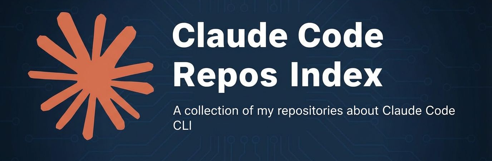
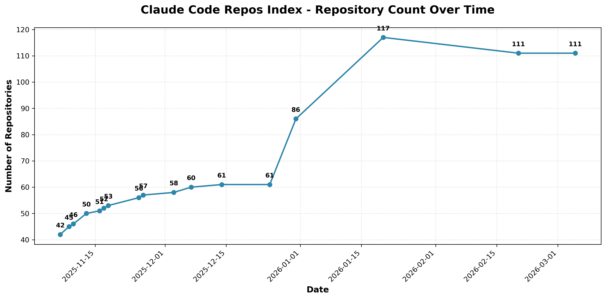
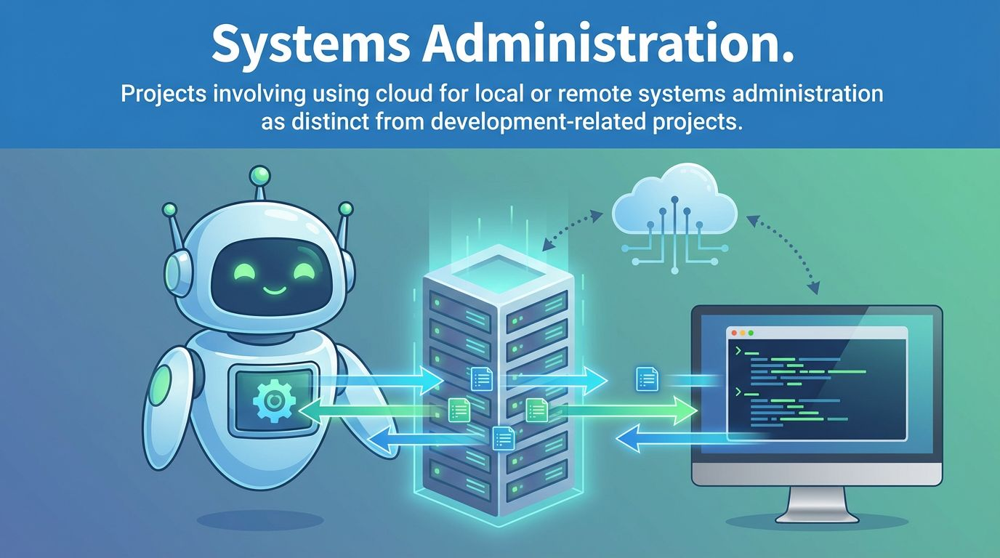
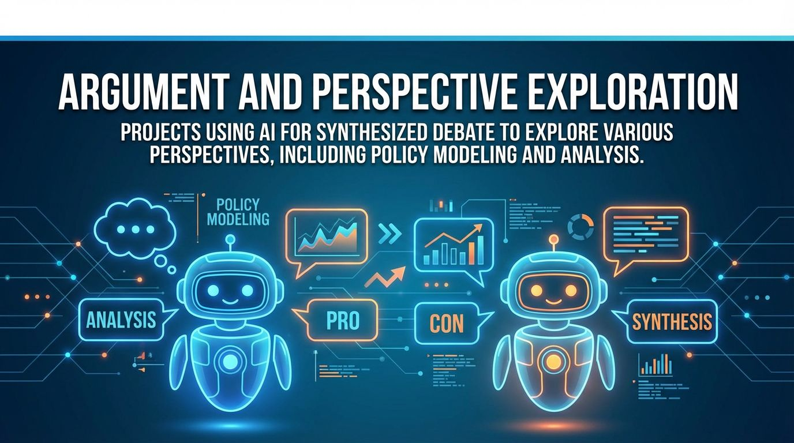
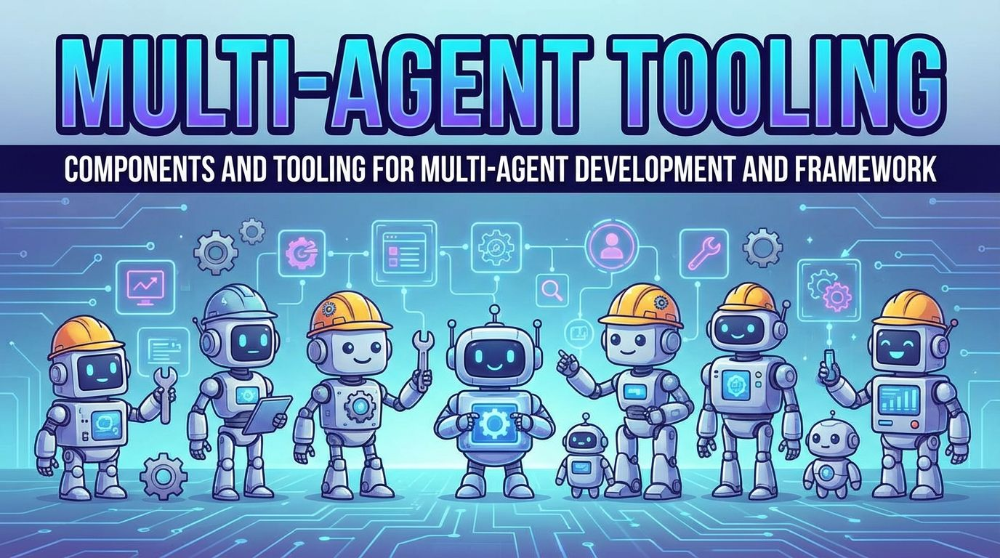
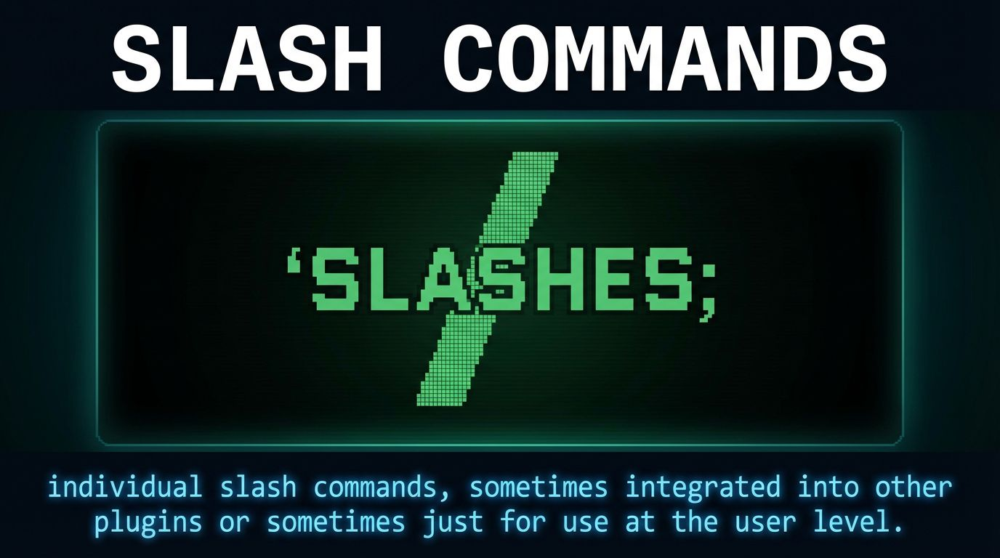
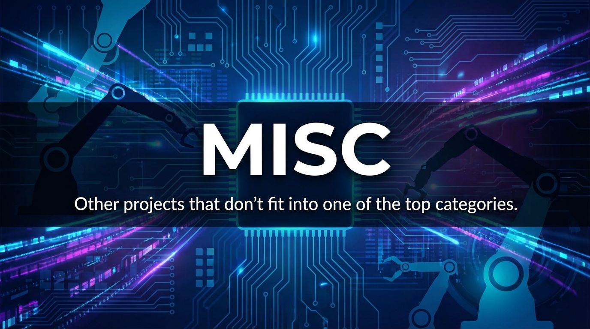

## Repository Growth

---

# Claude Code Repository Index

My Claude Code related repositories, organized by use case and category.

Most patterns, templates, and models are adaptable to other agentic AI CLIs and frameworks.

**[Browse the index online](https://claude.danielrosehill.com)** | **[Documentation portal](https://docs.bydanielrosehill.com)**

## Understanding This Index

This index showcases diverse applications of Claude Code beyond traditional software development. Key concepts:

| Type | Description | Badge |
|------|-------------|-------|
| **Claude Spaces** | Pre-configured workspaces using Claude as a Conversational UI Agent for structured workflows |  |
| **Templates** | Forkable starting points you can customize for your own use |  |
| **Non-Code** | Applications beyond software development (research, productivity, health, etc.) |  |

📖 **[What are Claude Spaces?](./claude-spaces.md)** — Detailed explanation of the Claude Spaces concept
📝 **[Notes on Templates & Workspaces](./notes.md)** — Additional context on these approaches

---

## Praise For This Repo

> *"This is either the work of a prolific genius, or a very clever bot (or both), although it hardly matters because the quality is so good - an index of 75+ Claude Code repositories published by the author - and I'm not talking about slop. CMS, system design, deep research, IoT, agentic workflows, server management, personal health... If you spot the lie, let me know, otherwise please check these out."*
>
> — [awesome-claude-code](https://github.com/wong2/awesome-claude-code)

For those wondering: I'm a real human ([danielrosehill.com](https://danielrosehill.com)). The repos and spaces in this index are generated using Claude Code but very much human-designed and refined.

## Commonalities

I've been using Claude Code daily for about six months, for everything from development to audio editing to SEO analysis. This is a diverse collection of repositories, but it tends to lean away from the classic code generation use cases. Instead, it explores the longer tail of what Claude Code can do — deep research, systems administration, legal workflows, health documentation, media monitoring, and more.

If there's a common thread, it's treating Claude Code less as a coding assistant and more as a general-purpose AI workspace that happens to run in a terminal.

---

# Systems Administration

Projects involving using Claude for local or remote systems administration as distinct from development-related projects.

### Claude Code LAN Manager
  

Workspace for centralized management of multiple LAN-connected machines through Claude Code.

#### Claude LAN Manager GUI

GUI application for managing local network devices through isolated, device-specific Claude Spaces.

---

### Claude Code Security Auditor
 

Multi-machine security auditing workspace covering antivirus, rootkits, permissions, and network exposure.

---

### Claude Conda Manager
 

Workspace for managing Conda environments on Ubuntu workstations with AMD ROCm hardware.

---

### Claude Docker Manager
  

Workspace template for Docker environment management with slash commands and diagnostic agents.

---

### Claude Home Assistant Manager Template
  

Template for managing Home Assistant OS with 20+ slash commands and 5 specialized agents.

---

### Claude Linux Desktop Manager
  

System administration interface for Linux desktop management with extensive slash commands.

---

### Claude OS Sync Agent
 

Synchronization tool for maintaining consistency between desktop and laptop configurations.

---

### Claude Proxmox Manager Template
  

Proxmox server management template with 38 slash commands and 10 agents for low-spec hardware.

---

### Claude Bug Catcher

Hotkey-triggered utility that launches Claude Code with relevant logs for real-time Linux debugging.

---

### Claude Code Remote Machine Admin Space
  

Template for managing individual remote machines via SSH with structured system profiles and logs.

---

### Claude Linux Server Manager
  

Ubuntu server management template with 38 slash commands and 10 agents for routine administration.

---

### Claude Rescue

Concept for deploying Claude Code into recovery shell environments for AI-assisted system repair.

---

### Claude Server Manager Template
  

Server administration template with 38 slash commands and 10 agents optimized for Docker deployments.

---

### Claude Server Mgmt Template SBCs
  

Server management template adapted for Single Board Computers and resource-constrained hardware.

---

### Claude Synology Manager
  

Template for managing Synology NAS devices through SSH and MCP with persistent context storage.

---

### Claude System Recovery Mode

Custom GRUB boot entry integrating Claude CLI into Linux system recovery workflows.

---

### Bash Alias Manager Claude

Workspace for managing bash aliases with YADM synchronization support.

---

### Claude Code Bash Aliases

Collection of bash aliases for common Claude Code operations on Linux.

---

## Android

### Claude ADB Workspace Template
  

Template for managing Android devices through ADB with device profiling and package management.

---

# Productivity & Planning

Workspaces for decision-making, personal planning, file management, and general-purpose productivity workflows.

### Claude Debugging Workspace
    

Structured debugging template supporting software bugs, process problems, and creative blocks through hypothesis-driven investigation.

---

### Claude Decision Evaluation Framework
 

Analyzes decisions through seven parallel frameworks (SWOT, ICE, Regret Minimization, etc.) with objective scoring.

---

### Claude Diary Planner Template
   

Forkable template for daily workflow and time management planning with Claude Code.

---

### Claude Personal Development Workspace
  

Workspace for tracking habits, skill acquisition, and self-improvement goals with AI coaching.

---

### Claude Google Drive Organiser
  

Template for managing and organizing Google Drive via rclone with configurable rules and slash commands.

---

# Legal

Workspaces and templates for legal research, case management, and evidence handling workflows.

### Claude Case File
   

Legal case management template with evidence tracking, chain of custody, and document organization.

---

### Claude Code Lawyer
   

Legal research template with structured intake, evidence handling, and professional document generation.

#### Claude Lawyer - Israel Edition
   

Israeli law adaptation with local court system knowledge, Hebrew support, and Israeli legal database links.

---

### Claude Evidence Assistant
    

Digital evidence management workspace with cryptographic verification and Library of Congress-compliant exports.

---

### Claude Legal Aid Clinic
   

Template helping legal aid seekers understand their rights and prepare case materials.

---

### ProofMode Unpacker
  

Utility for managing ProofMode evidence bundles with automated cloud backup and chain of custody preservation.

---

# Health & Wellbeing

Workspaces and templates for health documentation, medical visit management, therapy tracking, and health-related research.

### Claude ADHD Research Workspace
  

Research repository documenting barriers to ADHD medication access and advocacy for policy reform.

---

### Claude Health Helper
   

Workspace for organizing personal health documentation, visit preparation, and medical report summaries.

---

### Claude Therapy Tracker
   

Template for tracking therapy sessions, mental health goals, and therapeutic planning.

---

# Communications & Writing

Workspaces and templates for content creation, blog management, writing workflows, and communications strategy.

### Claude Blog Manager
  

Template for managing blog content through headless CMS platforms with drafting and publishing workflows.

---

### Claude Code Writing Squad
 

Multi-agent writing system that refines text through specialized editing agents.

---

### Claude Communications Strategist Template
    

Full-featured workspace for communications strategy with 12 agents and 14 slash commands.

---

### Claude Visual Communications Space
   

Template for enhancing long-form content with AI-generated visuals via fal-ai MCP.

---

### Claude Website Update Sender

Automated workflow for sending polished update emails about website changes via Resend MCP.

---

### Claude Writing Space Template
  

Writing workspace with sequential versioning, editing agents, and headless CMS publishing support.

---

### Declaude
 

Personalized text rewriting rules that consolidate into a slash command for refining AI-generated documentation.

---

# Financial Planning

Workspaces and templates for budgeting, purchasing decisions, and personal finance management.

### Claude Budget Workspace Template
   

Template for managing household budgets and financial planning with Claude Code.

---

### Claude Purchasing Assistant
   

Structured purchasing decision workspace that evaluates products against user-defined criteria and local pricing.

---

# Career

Workspaces and templates for job searching, career planning, and professional development.

### Claude Job Search Strategist
    

Job search workspace with specialized agents for company research, resume tailoring, and interview preparation.

---

# Business

Workspaces and templates for business planning, idea evaluation, and organizational continuity.

### Claude Business Continuity Planner
  

Workspace for developing ISO 22301-aligned business continuity programs with slash commands.

---

### Claude Business Idea Evaluator
 

Framework for evaluating and ranking business ideas using the ICEC methodology.

---

# Privacy & Anonymity

Workspaces and templates for document redaction, identity protection, and PII obfuscation.

### Claude Redaction And Obfuscation
  

Document redaction and identity protection workspace for handling sensitive information.

---

# Technology & Hardware

Workspaces for hardware planning, PC builds, and technology procurement.

### Claude Rig Planner
   

Template for planning computer hardware upgrades with profiling, recommendations, and VAT-compliant estimates.

---

### Ivory PC Builder
 

PC building assistant with real-time pricing from Ivory.co.il and scraped catalog management.

---

# Marketing

Workspaces for SEO, web analytics, PR monitoring, and media tracking.

### Claude Media Monitor
   

Workspace for systematic news collection and organization with metadata and schema validation.

---

### Claude News Fetcher - Media Monitoring System
   

Full-featured media monitoring workspace with structured data capture and batch processing.

---

### Claude Web Analytics Space
  

Workspace template for SEO analytics with data cleaning, analysis, and reporting workflows.

---

# Research

Projects using Claude and agentic systems for deep research, report generation, and information synthesis.

### Claude Deep Research Model (Notes / Documentation)
 

Framework for iterative deep research using Claude with voice pipeline and structured outputs.

---

### Claude Deep Research Template (Implementation Template)
   

Structured workflow for systematic research with specialized agents across academic and technical domains.

---

### Claude Github Shortlister
  

Template for systematically evaluating and shortlisting GitHub repositories using AI-powered analysis.

---

### Claude OSINT Investigator
  

Template for conducting open-source intelligence investigations with organized evidence management.

---

### Claude Report Parsing Space Template
   

Template for critical analysis of reports with slash commands for triage, argumentation, and source extraction.

---

### Claude Dork
 

Agent that generates platform-specific search dorks across Google, Reddit, Twitter/X, and more.

---

### Claude Georeaction Researcher

Researches international reactions across 193 UN member states using Gemini with search grounding.

---

### Claude Stack Research Workspace
  

Environment for evaluating software solutions with specialized agents for technology comparisons.

---

# Argument and Perspective Exploration

Projects using AI for synthesized debate to explore various perspectives, including policy modeling and analysis.

### Claude Change My View
   

Workspace for challenging personal beliefs through AI-generated counterarguments and rebuttals.

---

### Claude Think Tank
   

Virtual think tank framework using AI agents for research and policy proposal development.

---

### Claude AI Conference
 

Simulated conference where 30+ AI personas deliver speeches on AI's impact from diverse perspectives.

---

# Context and Personalization

Projects exploring using Claude and related tooling for personalized user engagement, including through RAG, interviewing methods, and context injection.

### Claude Code Context Toolkit
  

Bridges human-friendly CONTEXT.md files with AI-optimized CLAUDE.md briefings via slash commands.

---

### Claude Code Repo Managers ClaudeMD
 

Pre-configured CLAUDE.md templates for managing different repository types.

---

### Batch ClaudeMD Repo Creator

Automation workspace for batch-adding CLAUDE.md files across multiple GitHub repositories.

---

### Claude Model Identifier
 

Prompt template for verifying the correct Claude model variant at conversation start.

---

### Claude Spaces Model

Documentation and catalog of the Claude Spaces pattern for non-development operational workspaces.

---

### Claude Space Self-Ideator

Ideation workspace for generating and documenting new Claude Space concepts.

---

### Split Context Setup
 

Slash command that scaffolds a structured context store with topic-based subfolders.

---

### Claude Spec Starter
  

Template that transforms unstructured project descriptions into organized specifications for Claude Code.

---

### CONTEXT.md
 

Workflow methodology for separating human-authored context from structured AI agent briefings.

---

### Home Folder Claude MD
 

Version-controlled CLAUDE.md for applying Claude Code settings across a home directory.

---

### Linux Desktop ClaudeMD Seeder
 

Automatically generates contextual CLAUDE.md files across a Linux desktop filesystem.

---

### Private And Public Claude MD

Tools for managing public and private CLAUDE.md files with security-focused git configuration.

---

# Multi-Agent Tooling

Components and tooling for multi-agent development and orchestration frameworks.

## Multi-Agent Systems

### Agent Junction
 

MCP server enabling encrypted peer-to-peer communication between Claude Code instances on localhost or LAN.

---

### Claude Agent Picker Pattern
 

Framework for assembling context-optimized multi-agent crews with minimal overlap.

---

### Claude Task Manager
 

Sequential task queuing system addressing context window exhaustion in agentic coding tools.

---

### Claude Repo Jumper

Skill for automating repository handovers with context-passing in multi-repo systems.

---

### Claude Tech Research Team
 

Multi-agent system for evaluating software and hardware technologies with automated reporting.

---

### Ecosystem Mapper
 

Agent that discovers, categorizes, and visualizes technology ecosystems from keyword searches.

---

### Panel Of Claude
 

Multi-agent panel discussion simulator providing multi-dimensional analysis across expert perspectives.

---

## Agent Libraries & Collections

### Claude Development Agents
 

Curated toolkit of 74+ Claude Code configurations for development workflows and multi-agent coordination.

---

### Claude Sub-Agent Network
 

Collection of system prompts and configurations for development, operational, and creative tasks.

---

### Cool Claude Code Stuff

Curated collection of Claude Code projects and resources organized by category.

---

## Workspace Setup & Management

### Claude Workspace Setup Helper
 

Interactive tool for discovering, selecting, and cloning Claude Workspace templates.

---

## Documentation & Notes

### Claude Code Linux Notes

Personal documentation of workflows and tips for using Claude Code on Ubuntu with KDE Plasma.

---

### Claude Code Notebook
 

Minimal reference repository for documenting Claude Code usage patterns and workflows.

---

# MCP

Projects related to Claude and MCP tooling and setup.

### Claude Code MCP Command Generator

Generator for creating MCP server configuration commands for Claude Code.

---

### Claude Code MCP List

Curated index of MCP servers organized into 14+ categories for extending Claude Code.

---

### Claude MCP Guidelines
 

Guideline snippet for directing Claude Code on MCP usage across environments.

---

### MCPM Claude Code Docs

Documentation for integrating Claude Code with MCPM external MCP server manager.

---

### Smithery Claude Code MCP Jumpstarter

Curated collection of 35+ MCP servers with interactive installer across 15+ categories.

---

# Plugins

My Plugin Marketplace enhancing capabilities in Claude.

### Claude Code Plugins Marketplace

Centralized marketplace for discovering and installing Claude Code plugins via simple commands.

---

### Claude Code Marketplace Hub

Decentralized directory aggregating multiple community-maintained Claude Code plugin marketplaces.

---

### Claude Code Plugin

Meta-plugin for managing Claude Code configuration, slash commands, and agent development.

---

### Claude Janitor

Plugin for cleaning up repositories by removing Claude-related artifacts and configurations.

---

### Make Agent Friendly
 

Plugin that prepares human-developed codebases for agentic development with restructuring and documentation.

---

### User Manual Plugin

Plugin for generating personalized user manuals and private documentation for codebases.

---

### QA Team Plugin
 

Multi-agent quality assurance system with specialized agents for code review and validation.

---

# Slash Commands

Individual slash commands, sometimes integrated into other plugins or sometimes just for use at the user level.

### AI-Human Attribution Adder
 

Adds AI/human attribution sections to README files for transparent tool usage documentation.

---

### Claude App Optimiser
  

Slash command deploying a sub-agent for codebase optimization and dead code removal.

---

### Claude Code Linux Desktop Slash Commands
 

System administration slash commands for Linux desktop environments.

---

### Claude Document This
 

Methods and slash commands for documenting system changes made by Claude Code.

---

### Claude File Organiser Super Slash
 

Slash command that transforms disorganized filesystems into well-structured directories.

---

### Claude Slash Commands
 

General-purpose slash command library for various Claude Code workflows.

---

### No Wheel Inventions
  

Slash commands encouraging use of existing libraries instead of building custom solutions.

---

# Miscellaneous

Other projects including meta-resources, feedback, and utilities that span multiple categories.

### Claude Code Context Feature Requests

Feature requests for improving Claude Code's context handling capabilities.

---

### Claude Interview

Transcript from an Anthropic user research interview on AI tools and adoption.

---

### Claude Local AI Agent Research

Research into agentic AI tools optimized for system administration rather than code generation.

---

### Non-Code Claude Code

Showcase of creative Claude Code applications beyond traditional software development.

---

### New Turn Claude Hook

Tool that determines whether to continue an AI conversation or start fresh for optimal context.

---

### Claude Is Awesome
  

Template for creating curated resource lists with automated formatting and badge generation.

---

### Claude Resource List Builder
  

Template for building curated resource lists with organized taxonomy and PDF export.

---
