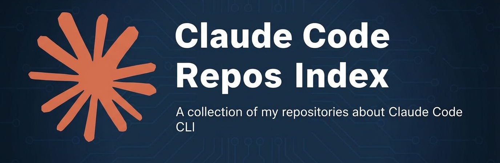
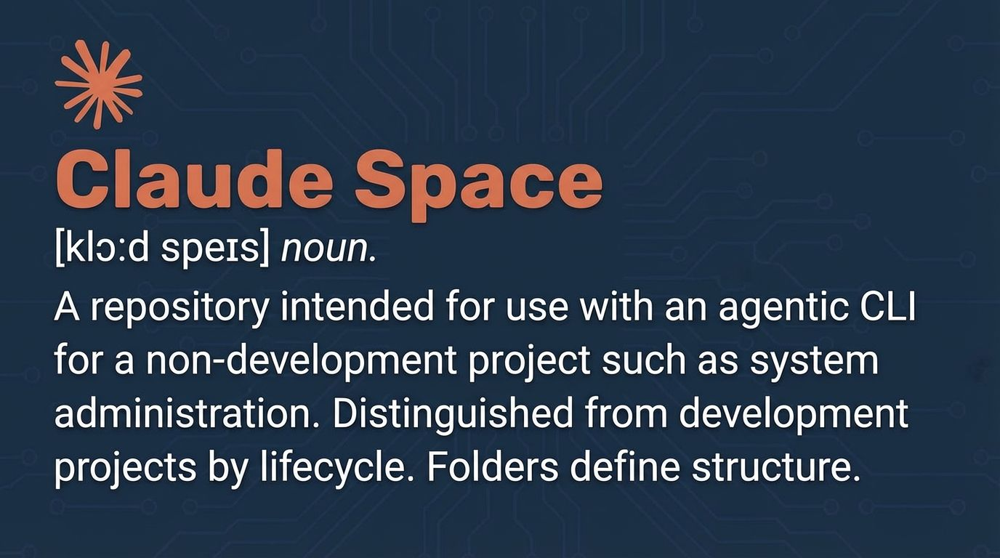
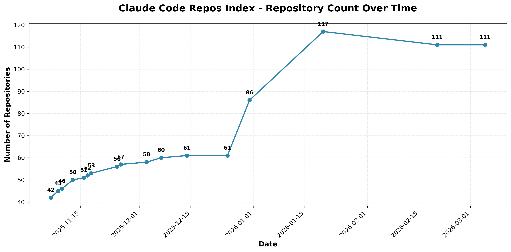
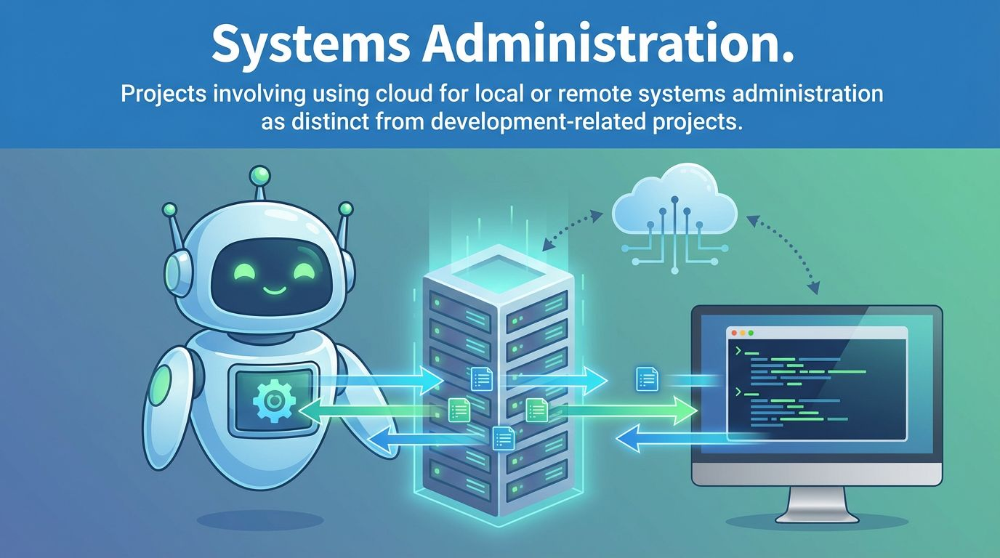
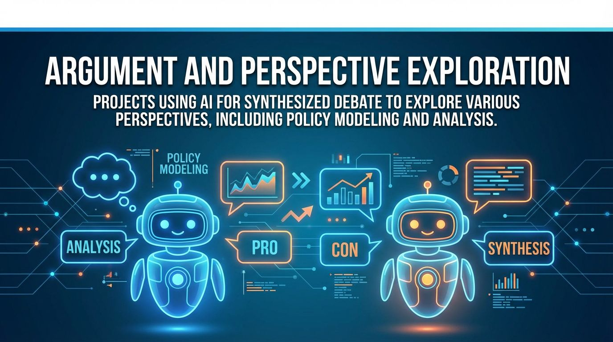
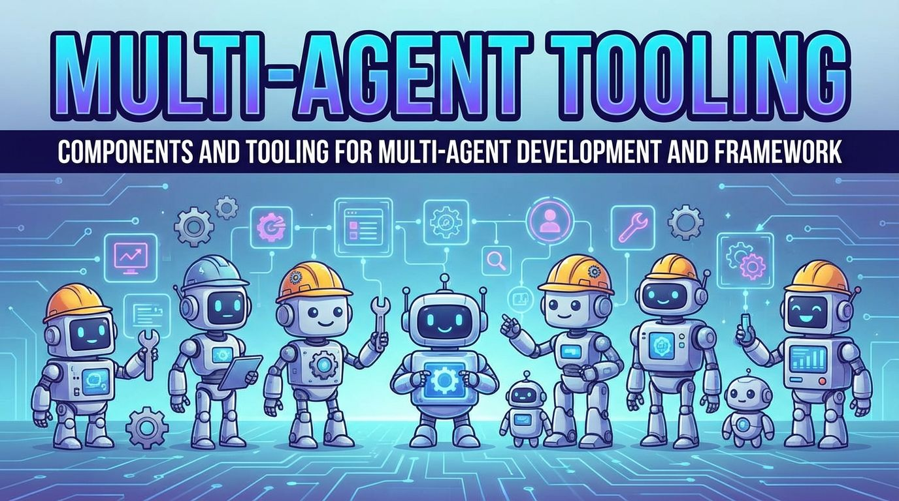
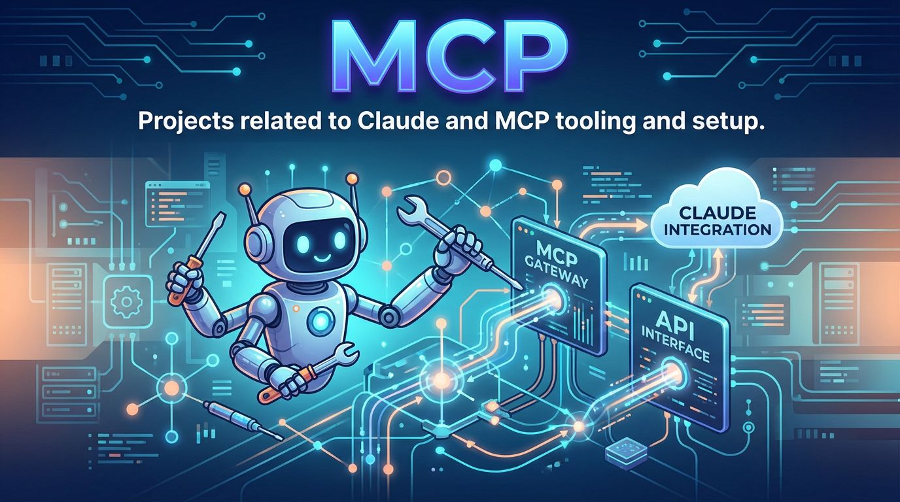
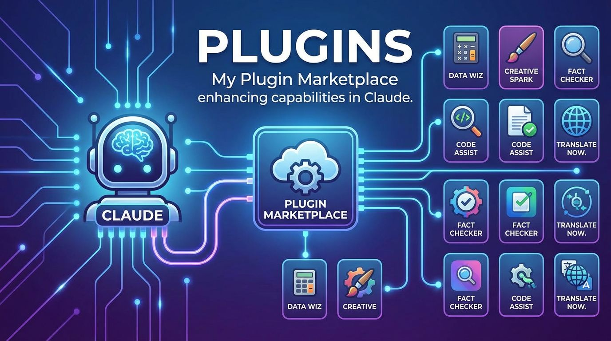
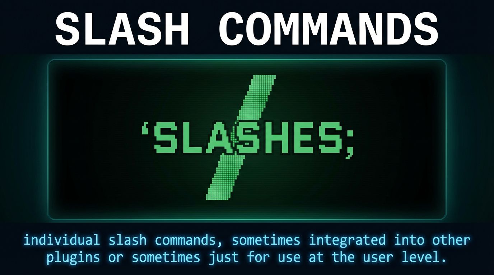
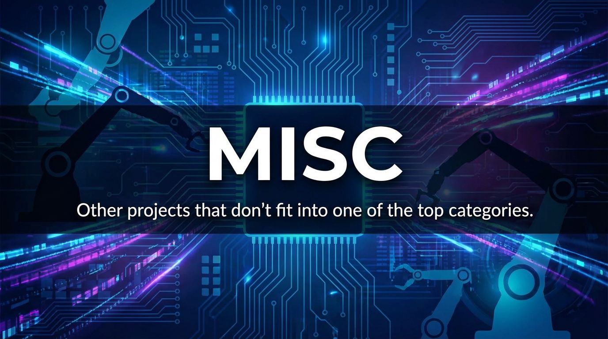

# Claude Code Projects Index

A curated collection of Claude Code projects, agent workspace blueprints, and related resources — organized by use case. Most patterns here adapt to other agentic AI CLIs and frameworks.

**[Browse online](https://claude.danielrosehill.com)** · **[Plugins Marketplace](https://github.com/danielrosehill/Claude-Code-Plugins)** · **[Documentation portal](https://docs.bydanielrosehill.com)** · **[What are Claude Spaces?](./claude-spaces.md)**

> 🧩 **My Claude Code Plugins Marketplace** — [danielrosehill/Claude-Code-Plugins](https://github.com/danielrosehill/Claude-Code-Plugins) — 28 focused **cluster plugins** covering workflows across sysadmin, research, media, writing, planning, and more. Each plugin ships the domain primitives (commands, skills, agents) globally and provisions per-project scaffolds on demand — so you install the plugin once and scaffold new workspaces from it as needed, rather than cloning a separate template repo per workflow.

---

## Contents

**Workspaces by Domain**
- [Systems Administration](#systems-administration)
- [Productivity & Planning](#productivity--planning) · [Legal](#legal) · [Health & Wellbeing](#health--wellbeing) · [Communications & Writing](#communications--writing) · [Financial Planning](#financial-planning) · [Career](#career) · [Business](#business) · [Privacy & Anonymity](#privacy--anonymity) · [Technology & Hardware](#technology--hardware) · [Marketing](#marketing)
- [Research](#research)
- [Argument and Perspective Exploration](#argument-and-perspective-exploration)

**Configuration & Tooling**
- [Context and Personalization](#context-and-personalization)
- [Multi-Agent Tooling](#multi-agent-tooling)
- [MCP (Model Context Protocol)](#mcp-model-context-protocol)

**Extensions & Scaffolds**
- [Plugins](#plugins)
- [Templates / Scaffolds](#templates--scaffolds) — *recommended way to spin up a new workspace*
- [Slash Commands](#slash-commands)

**Other**
- [Miscellaneous](#miscellaneous)

---

## About This Index

I've been using Claude Code daily for about six months — for development, but also audio editing, legal research, SEO analysis, health documentation, systems administration, and a long tail of non-code use cases. This index is the result: a collection of **agent workspaces** (repositories structured as self-contained environments for a specific activity) alongside supporting tooling — plugins, context files, MCP servers, and slash commands.

If there's a common thread, it's treating Claude Code less as a coding assistant and more as a general-purpose agent workspace that happens to run in a terminal.

| Type | What it is | Badge |
|------|------------|-------|
| **Agent Workspace** | Pre-configured repo using Claude as a conversational UI for a domain-specific workflow |  |
| **Template** | Forkable starting point you can customize |  |
| **Non-Code** | Applications beyond software development |  |

<strong>More context: the Agent Workspace Model, growth chart, praise</strong>

#### The Agent Workspace Pattern

All workspaces in this index follow the same pattern: a Git repository isn't just for code — it can serve as a complete, self-contained workspace for *any* activity. Each workspace uses a defined folder structure, a `CLAUDE.md` for agent instructions, slash commands, MCP configurations, and subagent definitions to create a purpose-built environment.

This pattern has been applied to everything from sysadmin and remote server management to legal research, health documentation, and financial planning — domains that have nothing to do with software development.

**Primitives globally, scaffolds per-cluster.** The tooling has been consolidated into **28 cluster plugins** (see [Plugins](#plugins)) — each one ships the domain primitives globally (commands, skills, agents for that cluster) and provisions a project scaffold on demand. So rather than forking a separate template repo for each new workflow, you install the relevant cluster plugin once and ask Claude Code to provision a scaffold wherever you need one.

#### Repository Growth

#### Praise

> *"This is either the work of a prolific genius, or a very clever bot (or both), although it hardly matters because the quality is so good - an index of 75+ Claude Code repositories published by the author... CMS, system design, deep research, IoT, agentic workflows, server management, personal health... If you spot the lie, let me know, otherwise please check these out."*
>
> — [awesome-claude-code](https://github.com/wong2/awesome-claude-code)

For the record: I'm a real human ([danielrosehill.com](https://danielrosehill.com)). The repos and workspaces in this index are generated with Claude Code but human-designed and refined.

#### Additional reading

- 📝 **[Notes on Templates & Workspaces](./notes.md)**
- 📖 **[What are Agent Workspaces?](./claude-spaces.md)**

---

# Systems Administration

Projects involving using Claude for local or remote systems administration as distinct from development-related projects.

> **See also:** The **[Claude Code Sysadmin Workspaces Index](https://github.com/danielrosehill/Claude-Code-Sysadmin-Workspaces-Index)** is a dedicated sub-index for all sysadmin workspace templates.

### Bash Alias Manager Claude

Workspace for managing bash aliases with YADM synchronization support.

---

### Claude Code Bash Aliases

Collection of bash aliases for common Claude Code operations on Linux.

---

### Claude LAN Manager 0126

GUI concept for Claude-driven LAN management, covering device discovery and network operations.

---

### Claude Linux Desktop Manager Notes 0426
 

Planning workspace for managing a Linux desktop with an agentic CLI, running raw notes through a refine/analyse/workflow pipeline.

---

### Claude OS

Multi-plugin installation and setup utility for orchestrating everyday Linux desktop use through Claude Code.

---

### Claude OS Playbook
 

Template using Claude Code as an Ansible stand-in for repetitive environment setup and supervision.

---

### Claude Rescue

Concept for deploying Claude Code into recovery shell environments for AI-assisted system repair.

---

### Claude Rescue Pi

Raspberry Pi jump host running the Claude Code CLI over Cloudflare Access and Tailscale as an emergency recovery surface for a Linux workstation.

---

### Claude System Recovery Mode

Custom GRUB boot entry integrating Claude CLI into Linux system recovery workflows.

---

## Linux - KDE Plasma

Projects specifically targeting KDE Plasma desktop integration and Linux desktop workflows with Claude Code.

### Claude Dolphin & Konsole Actions

KDE Dolphin right-click context menu actions (service menus) for launching Claude Code in various Konsole window layouts, including single terminal, split panes, and multi-instance grids.

---

### Claude Konsole Launcher

Launch utility for pairing Claude Code with Konsole on KDE Plasma.

---

### KDE Claude Runner

Plan for a KDE-native runner that starts and supervises Claude Code sessions from the desktop.

---

## Android

# Productivity & Planning

Workspaces for decision-making, personal planning, file management, and general-purpose productivity workflows.

> **See also:** The [Budgeting](https://github.com/danielrosehill/Claude-Budgeting-Plugin), [Personal Planning](https://github.com/danielrosehill/Claude-Personal-Planning-Plugin), [Career](https://github.com/danielrosehill/Claude-Career-Plugin), [Purchasing](https://github.com/danielrosehill/Claude-Purchasing-Plugin), [Shopping](https://github.com/danielrosehill/Claude-Shopping-Plugin), and [Ideation & Planning](https://github.com/danielrosehill/Claude-Ideation-Planning-Plugin) cluster plugins in the [Plugins](#plugins) section cover these domains.

# Legal

Workspaces and templates for legal research, case management, and evidence handling workflows.

> **See also:** The [Legal & Investigative](https://github.com/danielrosehill/Claude-Legal-Investigative-Plugin) cluster plugin in the [Plugins](#plugins) section covers this domain — evidence logging, document analysis, redaction, and brief generation.

### Claude Case File
  

Claude Code template for building version-controlled containers for legal files and case material.

---

# Health & Wellbeing

Workspaces and templates for health documentation, medical visit management, therapy tracking, and health-related research.

> **See also:** The [Personal Planning](https://github.com/danielrosehill/Claude-Personal-Planning-Plugin) cluster plugin in the [Plugins](#plugins) section covers this domain — diary, health, therapy, preparedness, and personal development variants.

### Claude ADHD Research Workspace
  

Research notebook investigating ADHD medication access, structured for sustained Claude-assisted enquiry.

---

# Communications & Writing

Workspaces and templates for content creation, blog management, writing workflows, and communications strategy.

### Claude Website Update Sender

Automated workflow for sending polished update emails about website changes via Resend MCP.

---

### Declaude
 

Personalized text rewriting rules that consolidate into a slash command for refining AI-generated documentation.

---

# Financial Planning

Workspaces and templates for budgeting, purchasing decisions, and personal finance management.

> **See also:** The [Budgeting](https://github.com/danielrosehill/Claude-Budgeting-Plugin), [Purchasing](https://github.com/danielrosehill/Claude-Purchasing-Plugin), and [Shopping](https://github.com/danielrosehill/Claude-Shopping-Plugin) cluster plugins in the [Plugins](#plugins) section cover these domains.

### Claude FX Pair Analyst Template
  

Claude Code workspace for FX pair analysis — historical data, quant and vol modelling, geopolitical context, and Typst PDF reports.

---

# Career

Workspaces and templates for job searching, career planning, and professional development.

> **See also:** The [Career](https://github.com/danielrosehill/Claude-Career-Plugin) cluster plugin in the [Plugins](#plugins) section covers this domain — role logging, offer comparison, application tracking, and salary benchmarking.

# Business

Workspaces and templates for business planning, idea evaluation, and organizational continuity.

> **See also:** The [Ideation & Planning](https://github.com/danielrosehill/Claude-Ideation-Planning-Plugin) cluster plugin in the [Plugins](#plugins) section covers business idea evaluation, decision frameworks, and simulation workflows.

# Privacy & Anonymity

Workspaces and templates for document redaction, identity protection, and PII obfuscation.

> **See also:** The [Legal & Investigative](https://github.com/danielrosehill/Claude-Legal-Investigative-Plugin) cluster plugin in the [Plugins](#plugins) section includes redaction and document-obfuscation workflows. For broader system hardening see the [Security Checkup](https://github.com/danielrosehill/Claude-Security-Checkup-Plugin) plugin.

### Claude Anonymisation Assistant Plugin

Assistant configuration for redacting personally identifiable details from documents.

---

# Technology & Hardware

Workspaces for hardware planning, PC builds, and technology procurement.

> **See also:** The [Purchasing](https://github.com/danielrosehill/Claude-Purchasing-Plugin) (includes a tech-procurement variant), [Sysadmin & Homelab](https://github.com/danielrosehill/Claude-Sysadmin-Homelab-Plugin), and [HP5200 Printer](https://github.com/danielrosehill/Claude-HP5200-Skill-plugin) plugins in the [Plugins](#plugins) section cover these domains.

### Claude Macropad V2
 

Dedicated macropad for driving Claude Code — approve, stop, new session, transcript navigation — with a host-driven status LED that lights when Claude is waiting on you.

---

# Marketing

Workspaces for SEO, web analytics, PR monitoring, and media tracking.

> **See also:** The [PR & Media Work](https://github.com/danielrosehill/Claude-PR-Media-Work-Plugin) cluster plugin in the [Plugins](#plugins) section covers coverage scanning, press summarisation, response drafting, and comms strategy.

# Research

Projects using Claude and agentic systems for deep research, report generation, and information synthesis.

> **See also:** The [Research Space](https://github.com/danielrosehill/Claude-Research-Space-Plugin) cluster plugin in the [Plugins](#plugins) section covers deep research, technical research, OSINT, geo-reaction, stack, ecosystem, and competitor research workflows.

### Claude A2A Research

Research notes on Agent-to-Agent (A2A) protocols and how they relate to Claude.

---

### Claude Deep Research Model (Notes / Documentation)
 

Framework for iterative deep research using Claude with voice pipeline and structured outputs.

---

### Claude Dork
 

Agent that generates platform-specific search dorks across Google, Reddit, Twitter/X, and more.

---

### Claude For OS Mgmt Research
 

Research workspace on using Claude and Claude Code for operating system management.

---

### Claude Open Router Model Research Plugin

Claude Code plugin for researching, filtering, comparing, and evaluating models on OpenRouter, pulling the live catalogue without an API key.

---

### Claude Tooling Prior Art
 

Public record of build-vs-adopt scans for Claude Code tooling: does a plugin, MCP server or skill already exist for a given requirement, or is it blue sky? Each scan keeps the searches — including the empty ones — against a closed verdict set with dated decay.

---

# Argument and Perspective Exploration

Projects using AI for synthesized debate to explore various perspectives, including policy modeling and analysis.

### Claude Change My View
   

Workspace for challenging personal beliefs through AI-generated counterarguments and rebuttals.

---

### Panel Of Claude
 

Exploratory model running multiple agents as a panel debate.

---

# Context and Personalization

Projects exploring using Claude and related tooling for personalized user engagement, including through RAG, interviewing methods, and context injection.

### Batch ClaudeMD Repo Creator

Automation workspace for batch-adding CLAUDE.md files across multiple GitHub repositories.

---

### Claude Code Repo Managers ClaudeMD
 

Pre-configured CLAUDE.md templates for managing different repository types.

---

### Claude Context Analysis 0526

Redacted point-in-time dump of `/context` from a heavily-pluginned Claude Code session, analysing where the context budget actually goes and what is eagerly versus lazily loaded.

---

### Claude Model Identifier
 

Prompt template for verifying the correct Claude model variant at conversation start.

---

### Claude User Context Pattern
 

Depersonalised reference pattern for organising user-level `~/.claude/` context: a lean top-level `CLAUDE.md` that routes to topical `context/*.md` files (system environment, git rules, MCP usage, file organisation, etc.) loaded only when relevant.

---

### ClaudeMD Turnstile
  

Pattern for maintaining separate CLAUDE.md files for developers and for end users of the same repository.

---

### CONTEXT.md
 

Workflow methodology for separating human-authored context from structured AI agent briefings.

---

### Habits Of Claude
 

Splits a user-level system prompt into one file per standing habit, assembled into a pasteable block and a JSON index. Ships skills to install a subset into any CLAUDE.md and to reconcile drift when the prompt and the repo disagree.

---

### Home Folder Claude MD
 

Working CLAUDE.md for a home directory on an Ubuntu Linux desktop.

---

### Linux Desktop ClaudeMD Seeder
 

Automatically generates contextual CLAUDE.md files across a Linux desktop filesystem.

---

### Private And Public Claude MD

Tools for managing public and private CLAUDE.md files with security-focused git configuration.

---

### Split Claude MD Pattern
  

Pattern for splitting a home-level CLAUDE.md into directives plus on-demand context files, optimised for context handling.

---

### State Of Claude Context 0426

Q&A notes on where context bloat accrues given the current shape of the Claude Code harness and its primitives.

---

### The User Voice Types
  

CLAUDE.md snippets and slash commands telling Claude to silently infer around transcription errors from voice typing and stray keystrokes from one-handed or distracted typing.

---

# Multi-Agent Tooling

Components and tooling for multi-agent development and orchestration frameworks.

## Multi-Agent Systems

### Agent Briefing Gateway
 

Design model for an orchestration agent that buffers a human from a batch of working sub-agents — one consolidated brief per cycle, a budgeted override channel, and resumable approval gates.

---

### Agent Junction
 

MCP server enabling encrypted peer-to-peer communication between Claude Code instances on localhost or LAN.

---

### Claude Agent Picker Pattern
 

Framework for assembling context-optimized multi-agent crews with minimal overlap.

---

### Claude Agent Workspace Generator
 

Launchpad for creating standardized workspace templates conforming to the Agent Workspace Model v1.1 spec, with slash commands to generate, validate, and publish new workspaces.

---

### Claude Fleet Traffic Shaper
 

Specification for a local proxy that assigns priorities to concurrent Claude Code sessions and shapes their aggregate traffic, so rate limiting degrades background work instead of landing at random. Includes a prior-art survey of the multi-agent proxy and queueing landscape.

---

### Claude Development Agents
 

Curated toolkit of 74+ Claude Code configurations for development workflows and multi-agent coordination.

---

### Claude Sub-Agent Network
 

Collection of system prompts and configurations for development, operational, and creative tasks.

---

### Cool Claude Code Stuff

Curated collection of Claude Code projects and resources organized by category.

---

## Workspace Setup & Management

### Claude Plugin Workspace Vault
 

Architecture for Claude Code plugins that do sustained work: a public plugin, a private workspace instantiated from a template repo, and a vault at `~/.claude-plugins/<name>/` for user data.

---

### Claude Skill Definer
 

Multimodal workspace for defining Claude Code skills from voice notes, videos, images and text, or written specs.

---

### Claude Vault Idea

Idea capture for a meta-plugin holding a personal vault of plugins and MCP servers, activated selectively per project to mitigate eager plugin description loading at user level.

---

### Claude Workspace Setup Helper
 

Interactive tool for discovering, selecting, and cloning Claude Workspace templates.

---

## Documentation & Notes

# MCP

Projects related to Claude and MCP tooling and setup.

### Claude Code MCP Command Generator

Generator for creating MCP server configuration commands for Claude Code.

---

### Claude Code MCP List

Curated index of MCP servers organized into 14+ categories for extending Claude Code.

---

### Claude MCP Guidelines
 

Home-folder CLAUDE.md snippet giving an agent guidance on which MCP server to reach for.

---

### Claude Meta MCP Slash
 

Template `/install-mcp` slash command that routes MCP server installations across multiple MetaMCP instances using a tiered preference system.

---

### How-To-MCP

Guide for instructing AI agents on how to provision and manage MCP server connections according to user-specific preferences, with a tiered decision matrix.

---

### MCPM Claude Code Docs

Documentation for integrating Claude Code with MCPM external MCP server manager.

---

### Smithery Claude Code MCP Jumpstarter

Curated collection of 35+ MCP servers with interactive installer across 15+ categories.

---

<!-- GENERATED FROM data/marketplace.json — do not edit by hand. Run scripts/sync_marketplace.py or npm run build. -->

# Plugins

All plugins registered in the [danielrosehill marketplace](https://github.com/danielrosehill/Claude-Code-Plugins). Install any of these with `/plugin install <name>@danielrosehill`.

## Systems Administration

### Desktop Manager
 

Linux desktop management — auto-profiles the local machine on first run and persists it to user data, then runs system checks, package install/remove, config application, hardware troubleshooting, service/log inspection against that profile.

---

### Security Auditor
 

Register machines and run repeatable Claude-Code-driven security audits over SSH, with timestamped reports and per-machine profiles.

---

### Security Checkup
 

Security and compliance — vulnerability scanning, system hardening, config audits.

---

### Sysadmin Homelab
 

Sysadmin and homelab — diagnose, status, update config, backup, with linux/docker/conda/proxmox/nas/adb/sbc/remote-admin/lan variants.

---

## Development & Debugging

### Debugging
 

Debugging — capture logs, isolate issue, diagnose error, track bugs, with code/system/issue variants. Includes a KDE hotkey utility for capturing live system bugs.

---

### Dev Debugger
 

Bug-ticket workflow for development repos — capture bugs into planning/bugs/, dispatch specialist remediation agents (reproducer, diagnoser, patcher, fix-documenter), document fixes, and ship releases.

---

### Dev Tools
 

Dev-tools — scaffold repos, multi-agent QA review, templatize. Session-handover commands and agent moved to claude-hopper in 1.2.0.

---

### Workspace Foundational
 

Foundational workspace — setup, context management, report parsing, inventory, template discovery, with 6 variants.

---

## Meta & Context

### Claude User Memory
 

Backend-agnostic persistent user memory for Claude Code. Ships a save/recall/commit contract with personal/work context routing; bring your own memory MCP (Pinecone, Mem0, or other) via a workspace memory-config.md.

---

### Claude Vault
 

Meta-plugin for per-project activation of dormant plugins and MCP servers from a personal vault. Mitigates user-level eager skill description loading.

---

### Personal Context
 

Builds and maintains a persistent, portable background context layer about the user — intake interview, ingestion of material they already have, gap analysis, scoped retrieval, maintenance and export. Plain markdown entries in a store the user owns, read through declared scopes and sensitivity levels; explicitly does not use model-managed memory. Ships the Portable Context Contract so issue-scoped workspaces can read it without re-asking who the person is.

---

## Research & Investigation

### Ideation Planning
 

Ideation and planning — capture, generate, evaluate, rank, simulate, and plan ideas, with ideation/single-idea-eval/multi-idea-ranking/feature-ideas/simulation/idea-capture variants and Typst PDF deliverables.

---

### Legal Investigative
 

Legal and investigative — log evidence, analyze documents, redact, generate briefs, with legal-research/evidence/osint/document-analysis variants.

---

### Research Space
 

Research — source log, summarize, deep-dive, export, with deep-research/technical/osint/georeaction/stack/ecosystem/competitor/purchasing/general-research-workspace/obsidian-vault variants. The obsidian-vault variant scaffolds the research loop as a working Obsidian vault (committed .obsidian/ config, frontmatter schema, wikilinks, templates, canvas). Includes a 30-agent tech research team for hardware/software stack evaluations (folded in from Claude-Tech-Research-Team).

---

### Social Feedback
 

Check what people are actually saying about a topic, product, or provider by searching curated social-discourse sources (Reddit, Hacker News, Stack Exchange, Trustpilot, YouTube, Lobsters).

---

## AI & Prompts

### AI Attribution
 

AI transparency — document human vs AI contributions, add attribution, audit provenance.

---

### AI Engineering
 

Prompt engineering — craft, eval, catalog, version, search prompts, with library/factory variants.

---

## Media & Content

### AI Video Producer
 

Drive an AI-generated video project end-to-end: creative brief, model selection, character sheets, script, storyboard, generation pipelines (text-to-image-to-video, voice-to-lip-sync, text-to-video, upscale), clip assembly, and final export. Ships fal.ai/Replicate/MiniMax MCP servers and fal-js + WaveSpeed Python SDK runners.

---

### Audio Production
 

Audio production — normalize, VAD, transcribe, diarize, podcast assembly, with engineering/podcast/transcript variants.

---

### Claude Transcription
 

Audio transcription — denoise, VAD, transcribe (Gemini/AssemblyAI/Whisper), clean, structure, export, with cloud and local engine backends.

---

### Media Library
 

Media library — catalog, tag, search, sort, dedupe assets.

---

### PR & Media Work
 

PR and media monitoring — scan coverage, summarize press, draft responses, comms strategy, with monitoring/response/strategy variants.

---

### Video Editing
 

Video editing, transcoding, video processing, and multimedia workflow automation. Two-tier workspace (index + project), per-user data store, and a growing set of ffmpeg/MLT/Kdenlive primitives.

---

## Writing & Documentation

### Content Writing
 

Content writing — draft, proofread, version, publish, style guides, with writing/blog/opinion/document variants.

---

### Knowledge Documentation
 

Knowledge documentation — index, cross-link, build taxonomy, version docs, with wiki/resource-library/process-docs/experiment-report variants.

---

### Technical Docs
 

Technical documentation — READMEs, reference docs, changelogs, environment docs, with api-reference/code-docs/environment-docs/dev-notebook variants.

---

## Personal & Planning

### Amazon
 

Amazon.com marketplace research — verified price, stock, rating, seller and specs read from the listing rather than the search grid; Prime-aware delivery dates checked against the ZIP they were actually rendered for; filtered signed-in search with tested extractors, a marketplace profile and a durable brand allowlist.

---

### Budgeting
 

Personal budgeting — log transactions, categorize, forecast, track goals, monthly reports.

---

### Career
 

Career planning — log roles, compare offers, track applications, salary benchmark, with planning/job-search/salary variants.

---

### Personal Planning
 

Personal life planning — log entries, review progress, set goals, with diary/health/family/house-search/preparedness/personal-dev/inbox variants.

---

### Procurement Tools
 

Marketplace-agnostic purchasing and procurement process — spec definition from a vague want or a photograph, annotated search vocabulary, intake, research, compare, evaluate, recommend, market-check, spec-driven market landscape surveys, live price/delivery scanning through your own VPN egress, preference memory, hardware-rig profiling primitives, with general/market-landscape/tech-procurement/recommendations variants.

---

### Shopping
 

Region-specific consumer shopping primitives — find products, compare local vendors, check availability, and generate ranked purchase recommendations. Ships variant scaffolds per supported region and a provisioning skill for fresh shopping workspaces. Marketplace-specific research (Amazon US, AliExpress Israel) now lives in dedicated per-marketplace plugins; the marketplace-plugins skill is the roster.

---

### Therapy Tracking
 

Organising therapy reflections — pre/post-session notes, goal tracking, and turning voice-memo transcripts into structured problem summaries. Not therapy: organises notes only. Workspace data lives outside the plugin so the same install survives plugin updates.

---

## Home & Hardware

### HP5200 Printer
 

HP DeskJet 5200 printer and scanner operations — ink levels, color/B&W printing, scanning, auto-discovery.

---

### Smart Home
 

Smart home — Home Assistant, Snapcast multi-room audio, Plex media server ops, with HA/audio/media-server variants.

---

## Filesystem & Organisation

### Filesystem Organiser
 

Filesystem organisation — scan, dedupe, cleanup, rename, sort for local directories and Google Drive, with local/gdrive variants. Includes organise-filesystem (modular modes) and super-organise (comprehensive single-pass) skills.

---

## MCP & Infrastructure

### Agent Relay
 

Direct agent-to-agent communication and coordination within a LAN. Two Claude instances on different machines exchange messages and files via a shared MCP relay server. Includes the relay server (Python/FastMCP, SQLite, content-addressed blob storage) and skills to deploy and connect clients. Trust-based, LAN-scoped.

---

### Unofficial MCP Builder
 

Author and maintain unofficial MCP servers for third-party APIs that don't ship one. Generate a server from the vendor's API docs verified against the live API with your own key, detect upstream drift on a schedule, and smoke-test against real operations. Bound by a committed api-surface.yaml recording what the API actually does versus what its docs claim. Publishes to npm.

---

## Adb

### Adb Ops
 

ADB (Android Debug Bridge) operations — onboard a phone, map folders, import media, capture screenshots, and manage bloatware with a persistent log.

---

## Agent To Agent

### Breakout Claude
 

Route an idea that surfaces mid-task but does not belong to the current repository into its own repo and its own agent, without derailing the work in flight. Uses the cross-session SendMessage/ListAgents layer for a push-model handoff — the seed brief is written to disk in the new repo and the message carries a pointer to it. Companion to interrupt-claude (same-repo interruption routing) and claude-hopper (session spawning and handover); breakout splits tracks rather than work or time. WIP.

---

## Air Quality

### Air Quality Toolkit
 

Look up current and historical air quality, calculate AQI from raw pollutant readings, and run modelling utilities. Defaults to WAQI with fallbacks to OpenAQ and AireLibre.

---

## Aliexpress

### Aliexpress Israel Skills
 

AliExpress shopping skills for Israel-based buyers — Choice-first search in ILS via a local browser, free-shipping filter, Israeli-reviews filter, single-listing landed-cost parse, and a running cart-value VAT-threshold nudge ($75 de-minimis).

---

## Analysis

### Report Analyst
 

Skeptical analyst toolkit for long reports — READ/SKIM/SKIP verdicts, structured extraction (arguments, findings, stats, case studies, key snippets), and an opinionated executive summary. Built-in Jaded Report Reader persona that refuses credit for filler.

---

## Awesome List

### Resource List Builder
 

Build, maintain, and audit curated GitHub resource lists (Awesome-style indexes) with AI-driven categorisation, alphabetised tables, and dynamic shields.io badges.

---

## Backup

### Backup Planner
 

Plan, document, and implement a backup and data-protection strategy for the current project — from architecture discovery through script generation and restore drills.

---

## Book

### Book Writing
 

Write a full-length reference or instructional book with teams of subagents — definition, planning, research, parallel chapter drafting, review, graphics and publication. Organised so no single agent is ever handed the whole book, because quality degrades long before a context window fills; consistency is carried by a style guide, per-chapter briefs and a continuity ledger instead of by shared context. Authorship only — print geometry hands off to kdp-publishing.

---

## Btrfs

### Snap It
 

Manage BTRFS snapshots via snapper and btrfs from Claude Code — create, list, diff, rollback, and prune subvolume snapshots. Includes /snap and /snap-before commands for one-shot and pre/post-paired snapshots around risky changes.

---

## Business

### Business Idea Eval
 

Evaluate, refine, and develop business ideas through structured lenses — VC review, TAM, B2B/B2C fit, assumptions, objections, hardware feasibility, dev specs, timelines, social impact — plus an LLM council pattern (subagents or Karpathy clone), synthesis, and Typst PDF outputs for internal and public-facing docs.

---

## Buttondown

### Buttondown Mgmt
 

Manage one or more Buttondown newsletters from Claude Code — multi-newsletter config, reusable email templates, drafts, sends, subscribers, and API ops grounded in a locally cached copy of the official Buttondown docs.

---

## Certification

### Spec Led Certification
 

Choose a professional certification specification-first rather than market-first. create-workspace stands the search up as a private GitHub repo instantiated from the Spec-Led-Certification template, so it survives the machine and its git history shows when the scorecard was frozen relative to when the research ran. Three entry points for the three situations — start-search onboards and runs the full intake, rerun-search archives the previous run and reports what moved in the market, update-profile changes what is stored about you and marks the scorecard stale. Intake writes five dated profile files — subject, current position read from evidence, learning preferences, objectives and standing positions, money and time — a weighted scorecard is derived from those alone and frozen before any credential is looked up, then candidates are scored against it with a source tier and confidence tag on every number. Hard requirements exclude rather than score down. Emits a ranked comparison and a Typst PDF whose figures are computed from the CSVs at compile time. All state is written to the working directory, never to an agent memory store.

---

## Claude Code

### Claude Code Feedback
 

File well-formed bug reports, feature requests, model-behavior reports, and documentation issues against anthropics/claude-code. Fetches the live issue templates, gathers required fields, and submits via gh CLI.

---

### Claude Hopper
 

Claude-Hopper — skills for hopping between discrete terminal-bound Claude Code sessions on Linux. Spawn new instances (Konsole), hand off context (full / clipboard / with-tasks), resume from handovers, and pick up leftover work.

---

### Claude Rudder
 

Claude-Rudder — collection of utilities to smoothen Claude Code UX. Context-gate workflow, log/blocker capture, plugin/MCP primitives, repo & docs spawning, and the canonical user-data storage convention. (Session-hopping skills moved to Claude-Hopper.)

---

### Style Switcher
 

Persona-recipe library for swapping Claude into themed personalities (Daredevil, Jaded IT, Reluctant, Chatty, Philosophical, Operational, Dubious, Hyper Creative, Approval Needed, Visionary, Claude FM, Claude Bouncer). Each recipe ships a banner image and sound effect, and applies via either a managed block in ~/.claude/CLAUDE.md or a repo-sandbox mode that holds the user CLAUDE.md aside.

---

## Claude MD

### Claude MD Tester
 

Safely swap ~/.claude/CLAUDE.md for test/joke configs via symlink. Terminal-only restore that does not depend on the Claude harness, so a hostile test config can never trap you.

---

### User Claude MD
 

Manage the user-level ~/.claude/CLAUDE.md and its chunked ~/.claude/context/ directory — audit, chunk, list, and edit global Claude Code user context for token efficiency.

---

## Copyq

### Copyq Scripting
 

Foundational advanced clipboard scripting skills for CopyQ on Ubuntu Linux — CLI reference, custom commands, tab/item management, global shortcuts, and command bundle import/export.

---

## Cups

### Network Cups
 

Discover, diagnose, and print to networked CUPS printers from Claude Code. Wraps the lan-mcp-cups MCP server and adds LAN discovery (avahi/Bonjour, arp-scan) plus ufw firewall sanity checks.

---

## Data Analysis

### Claude Data Analyst
 

First-pass data analysis toolkit: correlations, PII flagging, anomalies, hypothesis tests, data dictionaries, and trend analysis on a dataset in a folder.

---

## Data Cleaning

### Claude Data Wrangler
 

Data cleaning, enrichment, restructuring, packaging, and documentation skills for tabular and JSON datasets (no visualisation). 31 skills covering ISO standardisation, PII detection/synthesis, data dictionaries, SQL/graph/vector/HF/GeoJSON/API targets, date & Unicode hygiene, header & numeric-precision standardisation, multilingual header localisation, incremental upstream sync, and Typst-rendered PDF documents of the data.

---

## Data Ingestion

### Browser Data Capture
 

Streamline programmatic data ingestion against sites and apps that don't ship a documented API — capture network traffic (HAR, mitmproxy, or live tab via claude-in-chrome), map endpoints, infer schemas, and produce a draft OpenAPI spec you can build a stable client against. Ships skills for per-domain map documents, version-controlled storage in a private GitHub repo, and good-faith vulnerability disclosure if a finding turns up incidentally. White-hat use only.

---

## Data Visualisation

### Data Visualisation And Publishing
 

Create static and interactive data visualisations for reports, repos, and data storytelling. Purpose-organised inventory of 60+ validated open-source tools as a head start — static figures (Matplotlib, Seaborn, ggplot2), web charts (Chart.js, ECharts, Plotly.js, ApexCharts, Highcharts), high-perf (uPlot, Perspective, Lightweight Charts), bespoke (D3, Observable Plot, Vega/Vega-Lite, visx, Victory), Python/R apps (Bokeh, Dash, Altair, Streamlit, Gradio, Shiny, D-Tale, Briefer, Preswald), storytelling (Vizzu, VChart, vue-data-ui, SandDance), graphs (G6, sigma.js, Cytoscape, Gephi, Graphviz, GoJS, 3d-force-graph, Constellation), maps (deck.gl, react-map-gl, Leaflet, MapLibre, OpenLayers, folium, react-globe.gl), mobile (fl_chart, F2), BI (Superset, Metabase, Grafana, Kibana, Redash, Chartbrew), diagrams-as-code (Mermaid, PlantUML), domain-specific (Iris, QuantInvestStrats, XCharts, BizCharts, Tablesaw).

---

## Datasets

### Data Annotation
 

End-to-end data annotation toolkit. Prep raw data, design annotation schemas, annotate interactively with Claude (small scale) or scaffold Gemini batch inference (large scale), and publish to Hugging Face.

---

## Decision Making

### Decision Evaluation Framework
 

Apply 20+ classical decision-making frameworks (cost-benefit, pre-mortem, MCDA, decision tree, reversibility, regret minimization, OODA, Eisenhower, SWOT, second-order, opportunity cost, 10/10/10, inversion, base rates, Kepner-Tregoe, six hats, Cynefin, red-team, stakeholder map, time-horizon) to any major decision — parallel multi-lens analysis, synthesis, and Typst PDF export.

---

## Diagrams

### Nano Tech Diagrams
 

Generate, transform, and clean up tech diagrams and whiteboard photos via the Nano Banana 2 model (Fal AI). Wraps the nano-tech-diagrams MCP server with a curated prompt library across 5 diagram families and 28+ visual styles.

---

## Docs

### Repo To Content
 

Convert GitHub repos into polished content (PDF, white paper, internal doc, public-docs publication) via Typst, with optional AI banner generation and multi-target publishing.

---

## Donetick

### Donetick
 

Companion plugin for the donetick-mcp server. Bundles the MCP and adds skills for chore management against a self-hosted Donetick instance — daily brief, list/create/complete chores, label management.

---

## Education

### Teach This Repo
 

Uses a real code repository in reverse for developer education: assesses the learner's profile, builds a teaching plan grounded in the repo, writes lessons and file-by-file analyses with code samples drawn from the source, supports interactive Q&A, and typesets any of it as a PDF via Typst.

---

## Email

### Html Email Designer
 

Design and build responsive HTML email templates using Foundation for Emails, Maizzle, or MJML. Framework-agnostic authoring with email-client compatibility baked in.

---

### Rtl Email
 

Send email in right-to-left scripts (Hebrew, Arabic, Farsi, Urdu) that actually renders RTL. Plain-text email carries no direction metadata, so RTL bodies render LTR in many clients and multi-part numbers like account references reorder. Ships dir=rtl HTML templates, separate personal and business send skills inheriting saved signature profiles, and one-time signature setup. Works with Google Workspace MCP or Resend.

---

## Forecasting

### Geopol Sim
 

Thin orchestrator for geopolitical forecasting simulations. Scaffolds, runs, bundles, and grades simulations from multiple decoupled upstream templates (lean LLM-council and snowglobe-style actor-simulation variants).

---

## Forensics

### Digital Evidence
 

General-purpose digital-evidence processing: capture, hash, OpenTimestamps, ExifTool/MediaInfo metadata, BagIt packaging, immutable sync. Layers with legal-investigative for full chain-of-custody workflows.

---

## Freight

### Freight Vol Calculator
 

Freight volume arithmetic from a product's external dimensions — retrieves and cross-checks dimensions from a supplier listing, then pallet quantity across 11 pallet standards, container loads palletised or floor-loaded for 20 ft / 40 ft / HC / reefer / 13.6 m trailer with stated buffers and payload limits, master-carton permutations ranked by units per container, and freight cost per unit from rates you supply. Reproduces published trade figures; holds no rate data and makes no network call.

---

## Gimp

### Gimp
 

Bare-bones GIMP CLI wrapper for Linux: detect install (native/Flatpak/Snap/AppImage), persist a per-user profile, run Script-Fu batch ops, export images, install/list GIMP-side plugins.

---

## Github

### Gist Writer
 

Publish content to GitHub gists with clear AI authorship — Claude-authored solution gists and collaborative debug write-ups, both with model+date attribution, environment context, and a PII pre-flight scrub for public publishes. Visibility is a per-call parameter with a configurable default.

---

### Github Explorer
 

Semantic GitHub repo discovery for reusable components. Search, rank, overview, evaluate, and recommend open-source repos — Claude parses gh API results, weighing stars, activity, maintenance, license, and stack fit.

---

### Repo Mgmt
 

Repository management toolkit: organise and dedupe local repos, retrofit codebases with AI agent primitives, janitor-style cleanup, convert to Claude plugins, spin off breakaway or parallel-private repos; scan for dead remotes, missing clones, visibility risks, and stale archive candidates; bulk git ops across folders of clones plus an interactive PyQt6 prune GUI. Includes a preferences layer that remembers where different repo types live on disk. (PII scanning has moved to the standalone `pii-scanner` plugin.)

---

## Gpg

### Gpg Ops
 

GPG operations: generate keypairs, export public keys, encrypt, decrypt, sign, and verify files or text using the local GnuPG keyring.

---

## Greeninvoice

### Greeninvoice Ops
 

Operational commands and a skill for working with the Green Invoice MCP server — invoices, clients, expenses, and monthly summaries.

---

## Hardware

### Hardware Id Annotation
 

Identify and annotate hardware components from photos — circuit boards, motherboards, ICs — with overlays, datasheet cross-checks, and structured BOMs.

---

### Hardware Spec Assembly
 

Define hardware project BOMs with ESP32-first focus — onboarding captures location/vendors/on-hand gear, then skills for spec creation, live web research of parts (AliExpress/Adafruit/etc.), budgeting, sourcing, compatibility checks, wiring specs, PCB design starting points, assembly instructions, 3D-printable suggestions, and AI-generated mockups via fal.ai nano-banana.

---

## Home Assistant

### Home Assistant Mgmt
 

Manage a Home Assistant instance via SSH and the HA REST API — guided first-run onboarding, automation/entity authoring, service calls, TTS testing, and log review. Per-host config is stored outside the plugin so the same install works across multiple Home Assistant environments.

---

## Image

### Background Removal
 

Remove image backgrounds via rembg — single-pass, two-pass cleanup, batch mode, and KDE Dolphin right-click integration.

---

### Image Annotation
 

Capture screenshots and apply annotations (arrows, callouts, boxes, highlights, blur/redaction) on Linux via Pillow + ImageMagick, with batch WebP conversion and PDF bundling. Originals are never modified.

---

### Image Production
 

Image production — editing, format conversion, batch ops, and filesystem organisation by resolution, aspect ratio, orientation, format, EXIF time, camera, plus dedupe and metadata scrubbing.

---

## Inventory

### Declutter Genie
 

Inventory analysis and decluttering assistant — import a household inventory in any format, then identify discards, duplicates, resale targets, donation targets (geo-aware), insurance-worthy items, and generate throw-out / giveaway lists as CSV or PDF.

---

## Israel

### Israel Agent Skills
 

Claude Code agent skills for Israel and Hebrew-specific workflows: Hebrew translation, Hebrew typography, emergency readiness utilities, and regional lookups.

---

### Israel Opening Hours
 

Check opening hours for Israeli businesses, including hours stated relative to Shabbat and yom tov. Combines Google Business and easy.co.il for stated hours with Hebcal candle-lighting/havdalah times, resolving phrasing like 'reopens an hour after Shabbat' into concrete clock times. Bundles 56 Israeli locations with verified per-city candle-lighting customs.

---

### Israel Shopping
 

Israeli shopping workflows — tech retailers (Ivory, KSP, Bug, TMS), Zap price comparison, Hebrew term resolution, ILS conversion, RRP checks, PN cross-reference, brand identification, and AliExpress IL-context search (ILS/Hebrew, IL reviews, free-shipping, combo exclusion, local-vs-import compare).

---

### Netek Disconnect
 

Cancel Israeli service subscriptions (ניתוק) through netek.co.il — mobile, internet, landline, TV, international calling, water bars, newspapers and credit cards across 55 providers. Resolves the provider and exact Hebrew service string, validates the Israeli ID checksum and address, shows the exact request before sending, and submits only on explicit confirmation. Falls back to filling the form in Chrome when the API changes. Uses Netek's own private, undocumented backend — not a published API.

---

## Jewish

### Jewish Texts Reference
 

Look up Jewish texts and references via the Sefaria MCP server — Tanakh, Talmud, Mishnah, Halakha, Kabbalah, commentary, dictionaries, and topics. Includes nikkud add/strip skills (Dicta nakdan + removenikud APIs, offline regex, unikud fallback).

---

### Jewish Utilities
 

Misc Jewish utility skills: shabbat candle-lighting/havdalah, zmanim (GR"A + MG"A), parsha-of-the-week, Hebrew/Gregorian date conversion (sunset-aware), upcoming holidays (IL/diaspora), and daf yomi. Wraps zmanim-mcp-server and hebcal MCP. Onboarding captures location for halachic-time skills. Companion to jewish-texts-reference.

---

## Kde

### Kde Plasma
 

KDE Plasma (Wayland) runtime utilities — KWin scripting, plasmoid management, panel layout backup, virtual desktops & activities, KGlobalAccel shortcuts, theme/look-and-feel switching, KDE Connect, Klipper, Baloo, kwriteconfig safe-edit, plasma-restart helpers, qdbus introspection, kscreen save/apply, KWallet ops. Complements generic Linux desktop-management plugins.

---

### Kde Plasmoid Dev
 

Skill for developing KDE Plasma plasmoids (QML/Plasma 6 desktop and panel widgets) — scaffold, debug, package, install, and migrate Plasma 5 → 6.

---

## Kdp

### Kdp Publishing
 

Amazon KDP paperback production with Typst — choose a standard trim, typeset the interior with gutter-aware margins and an even page count, build the full-wrap cover last from the interior's measured extent, pre-flight for silent glyph substitution and stale spines, and assemble the upload folder. Production only; it does not write the book.

---

## Label Printer

### Label Printer
 

Print labels from Claude Code on Brother QL and P-touch label printers on Linux. Discovers printers over mDNS, USB and CUPS and keeps a machine-local registry so later prints can name one; renders text and QR labels to the pixel canvas of the loaded DK or TZe media; previews without touching the printer, because brother_ql converts and transmits in a single step with no dry run. Ships a media catalogue of DK and TZe product codes, reusable label templates in the user's data directory, and a Linux driver-install skill covering brother_ql, ptouch-print, mDNS and CUPS. Zebra and DYMO are discovered and registered but not yet printable. Also bundles the original streamable-HTTP MCP server for P-touch setups built around a USB print bridge.

---

## Learning

### Test Project Ideator
 

Generates specifications for practice/dummy development projects tailored to the user's learning objectives, technology stack, and proficiency level in each language or tool.

---

## Licensing

### License Populator
 

Recommend, generate, and populate software/content licenses. Reads from a user-managed template store and advises on optimal license choice given desired freedoms and constraints.

---

## Linux

### Easy Effects Manager
 

Manage Easy Effects on Linux: maintain a preset library, install/export presets, bind autoload to specific mics, test input levels, and set up clean voice-dictation chains. Works with Flatpak or native installs.

---

### Keyboard Scanner
 

Profile Linux keyboards, scan keycodes, and surface underused keys for remapping. Walks intake → keycode dump (xmodmap/XKB/evdev/libinput, X11 + Wayland) → tailored remap suggestions referencing keyd, kmonad, xremap, xmodmap, xbindkeys, input-remapper, autokey.

---

### Linux Av Manager
 

Manage antivirus, rootkit-detection, and UFW host firewall on a Linux desktop — install ClamAV/ClamTk/rkhunter (core) plus optional advanced tools (Lynis, chkrootkit, AIDE, debsecan), keep definitions current, run scans, schedule periodic runs, and configure conservative desktop-tuned UFW rules. Scan results stored in a user-defined folder set up on first run.

---

### Linux Debugging
 

Linux desktop debugging toolkit — targeted journal/boot/log inspection skills plus proactive logging instrumentation (persistent journald, kdump, sysstat, OOM protection) so AI agents can analyze hard crashes, freezes, and runtime issues. Targets Ubuntu + Wayland; forkable for other distros.

---

### Linux Packaging
 

Linux packaging and release workflows — Debian/.deb builds, npm publishing, GitHub release creation, agent deploy scripts, and local debugging

---

### Linux System Optimisation
 

Performance and space optimisation for Linux desktops — hardware-aware CPU/GPU/disk/memory benchmarks with governor / I/O scheduler / sysctl tuning, plus disk-usage analysis (BTRFS-aware), duplicate-file detection, package audit, and dev-clutter pruning (venvs, node_modules, caches).

---

### Os Sync Agent
 

Hardware-aware desktop-to-laptop environment sync for Ubuntu/Debian. Snapshots packages (apt/snap/flatpak/pip/conda/ollama) and dotfiles from a base machine and a remote machine over SSH, then produces an incremental install/remove/sync plan rather than a perfect clone. Ships /sync-os command and sync-environments skill.

---

## Llm Council

### Llm Council Creator
 

Scaffold new LLM Council projects from existing templates (Template, Grounded, Decide) or build bespoke council repos for specific purposes.

---

## Music Assistant

### Media Assistant Ops
 

Interface with a Music Assistant server via its local API — onboard a deployment, control players, snapshot speaker rosters, save/update per-player DSP presets, and apply a curated podcast EQ preset.

---

## Nfc

### Nfc Ops
 

NFC tag operations using libnfc — read, write, inspect, password-protect, and bulk-write from CSV with manual tag-by-tag feed.

---

## Nlp

### Text Corpus Analysis
 

Skills for analyzing large text corpora — topic modeling (BERTopic with temporal evolution), NER, categorization into fixed taxonomies, bottom-up category derivation, multi-level taxonomy design, word frequency, synonym clustering for voice-note/STT corpora, parametric stats, and metadata↔content correlation. Three execution lanes (classical NLP, local LLM via Ollama, cloud LLM via OpenRouter) with explicit cost-awareness: mandatory pre-run estimates for >1k-doc LLM passes, two-pass cheap→premium pattern, embeddings+clustering preferred over pairwise LLM comparison.

---

## Obd

### Obd Diagnostics
 

Read OBD-II data from an ELM327-class adapter, normalise it to JSON, and use it to diagnose faults and plan vehicle maintenance. WIP.

---

## Obs

### Obs Mgmt
 

Manage OBS Studio on Linux from Claude Code: detect install type (native/Flatpak/Snap/AppImage), enable and validate obs-websocket, ship a bundled obs-mcp MCP server for programmatic OBS control, back up configs to a user-defined folder, and install third-party OBS plugins.

---

## Openrouter

### AI Model Research
 

Research, discover, compare, and evaluate AI models on OpenRouter — backed by the bundled Model-Scout MCP server for live catalog data with caching. Subsumes the standalone open-router-model-research plugin and the Model-Scout-MCP server. 11 skills cover lookup, capability filtering (tools, vision, audio), recommendation, head-to-head comparison, deep evaluation, workload cost projection, and finding cheaper alternatives.

---

## Opnsense

### Opnsense Mgmt
 

Manage an OPNsense router/firewall via SSH and the OPNsense API — guided first-run onboarding, firewall rule inspection, network debugging, and host/log diagnostics. Per-host config is stored outside the plugin so the same install works across multiple environments.

---

## Optical

### Batch Optical Archivist
 

Plan and burn batch M-Disc / BD-R / DVD archives from a source directory on Ubuntu, with copy multipliers for offsite duplicates. Wraps growisofs, xorriso, and dvd+rw-mediainfo; optional K3B handoff for manual fallback.

---

## Pdf

### Digital Printing
 

Skills and an orchestrator agent for preparing PDFs for digital printing — resize, grayscale, font embedding, transparency flattening, image downsampling, color normalization, watermarks, footer burn-ins, cover pages, bleed-safety check, job folders, formal print orders, and email/Drive share.

---

### Document To Markdown
 

Convert PDFs to clean Markdown, chunk into logical sections (chapters, indexes, appendices), and extract embedded tables to CSV. Local-first via marker/docling/pymupdf4llm + camelot/tabula, with TOON manifests.

---

## Pipewire

### Claude Pipewire Skills
 

Claude Code skills for taming Pipewire/Wireplumber audio on Linux — manage default devices, persistent device-priority rules, per-app routing, mic level checks, and EasyEffects bindings.

---

## Planning

### Claude Document Nudge
 

Nudges Claude to document decisions, todos, sprints, and handovers into a structured planning/ tree by default — without being asked each turn. Ships a home-level CLAUDE.md snippet plus /nudge-install and /nudge-scaffold slash commands.

---

## Plugin Authoring

### Site Skill Builder
 

Site skills built by watching a site in your own signed-in Chrome — observe pages and endpoints, propose a skill roster for approval, then author skills that survive UI changes and probe for drift. Semantic handles only, never pixel coordinates. Every observation is classified publishable, private, or never-recorded, with a stop rule for incidental security findings.

---

## Plugins

### Favorite Plugins Installers
 

Curated batches of third-party Claude Code plugins, grouped by type/theme, installable in one command.

---

## Privacy

### Pii Scanner
 

Scan files, directories, or git repositories for personally identifiable information — credentials (gitleaks), generic PII (Microsoft Presidio), and matches against a user-maintained personal PII inventory (names, addresses, family, IDs) stored locally.

---

## Productivity

### Schedule Manager
 

Personal schedule, task, and meeting management. Routes mixed brain-dumps into Google Calendar (events) and Todoist (tasks); manages agenda/minutes Google Docs linked to events; produces wrapup logs and morning briefs. 22 skills covering Calendar/Todoist CRUD, firehose routing, task<->event migration, priority/date hygiene, and agenda/minutes lifecycle.

---

## Profiles

### Daniel Rosehill
 

Jump to Daniel Rosehill's public work from Claude Code — profiles (LinkedIn, X, GitHub, YouTube, npm, Kaggle, DeviantArt, Pexels), blog, Hugging Face, public repos by recency/stars/A–Z, bio, resume download, and contact/newsletter pages. Also refreshes this marketplace's local cache. A directory of one person's published output, not personal configuration.

---

## Proxmox

### Proxmox Mgmt
 

Manage a Proxmox VE host via SSH and the Proxmox API — guided first-run onboarding, VM/CT lifecycle, storage and ZFS inspection, log review, and update workflows. Per-host config is stored outside the plugin so the same install works across multiple Proxmox environments.

---

## Recovery

### System Recovery Mode
 

AI-assisted Linux system recovery — slash commands and agents (diagnose, logs, network, disk, services, packages) for diagnosing and fixing a broken system. Pairs with an optional GRUB/systemd installer that boots a minimal recovery TTY straight into Claude CLI.

---

## Resume

### Resume Typesetter
 

Manage a resume as JSON Resume schema data and render it with custom Typst templates. Onboard, iterate, fork variants, and version.

---

## Scraping

### Local Web Capture
 

Capture geo-restricted web content (articles, prices) via the user's own localhost so requests exit via the user's IP. Headless-first escalation ladder (Scrapling static -> stealth -> Playwright -> real Chrome via bb-browser). Project-local save (in-repo captures/) with global fallback. Batch capture with human + agent summaries, Typst PDF compilation, and arbitrary-language capture+translate (default Hebrew -> English).

---

## Sop

### Claude Sops
 

Keep your own standard operating procedures — the recurring things you do a particular way — as a private, versioned library of markdown files the agent reads on demand and follows. Distinct from sop-writer, which authors printed SOP documents for other people; these are procedures an agent executes. One delimited block in your CLAUDE.md points at the library, a generated INDEX.md carries id, title and a 'use when' trigger for each procedure, and exactly one file is read once a situation matches — so a library of forty procedures costs one table to consult rather than forty resident skill descriptions. Seven skills cover setup, run, write, edit, list, retire and sync. Procedures live in ~/.claude-user-data/sops/ as flat readable files inside a private git repo, mirrored across machines; the plugin repo never holds one. Each SOP declares an autonomy level (auto, confirm, confirm-each, manual) that records a default rather than granting permission, and a last_verified date meaning the procedure was seen to work rather than that the file was edited.

---

### Sop Writer
 

Project-scoped authoring tools for Standard Operating Procedures and decision flowcharts. Scaffold from templates, embed Mermaid/D2 diagrams, compile to printable PDFs via Typst, and assemble multi-document binders with TOC and page numbers.

---

## Spam

### Spamhole
 

AI-assisted defenses against pseudo-personalised wide-scrape outreach, AI-faked impersonation, and tracking-pixel surveillance. Capture spam to a personal corpus, analyse intent, suggest filter patterns, scan for tracking + ad-tracker pixels, draft unsubscribe replies, push server-side Gmail blocks via an email MCP, push DNS-level blocks to AdGuard Home, and contribute redacted findings to public anti-tracking lists. Bundles a stub AdGuard Home MCP.

---

## Spec

### Spec Starter
 

Spec-driven development workflow for Claude Code: turn unstructured project briefs (especially voice transcripts) into a versioned spec, modular context, and a CLAUDE.md scaffolded into your current repo.

---

## Stack

### Stack Evaluator
 

Component-level review of a project's technology stack, not its code — records the stack to docs/stack/ with the run date, checks each component for end-of-life and currency, finds architectural gaps (caching, backups, queues, rate limiting, observability), flags redundancy and over-engineering against the real workload, then emits a sequenced revision proposal and an execution brief. Re-runnable per repo with persistent decisions and finding history.

---

## Staging

### Loose Tasks
 

Loose skills that will be migrated into other plugins later. Recommended not to enable/use this!

---

## Support

### Contact Support
 

Contact a vendor's support desk from a registry of verified, dated contact routes rather than recalled ones — ticket URLs and which support plans can reach them, abuse and fraud addresses taken from mailto hrefs rather than page text, per-tier response windows, priority vocabulary, escalation ladders with SLA claim deadlines, pre-contact checks, and the plausible routes that turn out to be dead. Records the user's account identity and where credentials live (a pointer, never the secret), drafts the request with the identifiers the desk will demand, sends it through whichever channel is actually reachable, logs the ticket and chases it when the window elapses. Ships verified for Twilio only; extend with support-add-service. Work in progress — concept stage.

---

## Synology

### Synology Mgmt
 

Manage a Synology NAS via SSH — guided first-run onboarding, share/volume inspection, storage health, and file operations. Per-host config is stored outside the plugin so the same install works across multiple NAS environments.

---

## Synthetic Data

### Synthetic Data
 

Generate synthetic datasets from schemas, real data, or LLM-driven personas. Tabular fit-and-sample (SDV: GaussianCopula, CTGAN, TVAE), Faker/Mimesis schema generation, deterministic PII swap, LLM-driven real-to-synth conversion for unstructured records, and SDMetrics-based quality/privacy evaluation (plus embedding-based leakage checks for text).

---

## Task Management

### Task Queuer
 

Repo-based task queueing system with categorisation and prioritisation. Scaffolds a planning/ folder, logs tasks (single, batch list, or voice-transcribed), buckets them by category, and hands prioritised work off to the repo's orchestration agent.

---

## Taxonomy

### Taxonomy Creation
 

Generate taxonomy and lookup tables (countries, currencies, languages, US states, timezones, custom domain taxonomies) and load them into Postgres, SQLite, MySQL, or export to CSV/JSON/SQL seed files. For data engineers, CMS builders, and eval pipeline authors.

---

## Text

### Novelty Text Editor
 

Rewrite text in deliberately ridiculous styles — Shakespearean, medieval, archaic, chaos-case, over-salesy, platitude-stuffed, pseudobot, plus length transforms (elongate / truncate). Nine no-config skills for stylistic mischief.

---

## Toon

### Get Toony
 

Convert JSON, CSV, YAML, and other structured data into TOON (Token-Oriented Object Notation) — a compact, lossless re-encoding that uses ~40% fewer tokens than JSON when fed to LLMs. Wraps @toon-format/toon and tracks the wider ecosystem (Python, Java, .NET, PHP, Rust ports).

---

## Travel

### Travel Packing
 

Make optimal use of a baggage allowance on an international itinerary — research each carrier's real checked, cabin and personal-item allowance per segment with a source and a confidence level for every figure, compute the binding limit that governs the journey, inventory what is carried by weight, reconcile scale readings against the inventory, solve the allocation to bags and packing cubes, price every way out of being over, and rank an emergency leave-behind list by cost per kilogram saved. Renders a one-page airport counter card and a per-bag packing list as PDF via Typst and as Markdown. One trip workspace per itinerary.

---

## Tts

### Text To Speech Toolkit
 

Skills for preprocessing text for TTS engines — SSML conversion, ElevenLabs markup (grounded in live ElevenLabs prompting docs), TTS safety review, and manual prosody addition. Non-destructive by default: edits land in an edited/ folder alongside an unchanged original/ copy.

---

## Typst

### Programmatic Doc Generation
 

Build programmatic document generation pipelines — Typst templates for local batch rendering, plus integration scaffolding for n8n and cloud rendering services (Carbone, PDFMonkey, APITemplate, DocRaptor, Docmosis, Adobe Doc Gen).

---

## Userscript

### Userscript Development
 

Develop, test, and publish Tampermonkey userscripts — scaffolding, in-browser validation via Claude in Chrome, README generation, and version bumping.

---

## Visuals

### Visual Communications
 

Plan and prompt-engineer AI-generated visuals (images, diagrams, video) for whitepapers, blog posts, and long-form content. Six skills cover project onboarding, visual ideation, prompt generation, project listing, fal-ai execution, and a resolution/style reference.

---

## Voice

### Claude Pa
 

Passive-aggressive PA system. Claude barks status updates over a speaker; if ignored, escalates across the house via Home Assistant or MQTT. Includes pre-recorded voice packs, RGB signal bulb, full-screen flash overlay, and a quiet-mode skill that translates natural-language pause/schedule requests.

---

## Zigbee

### Zigbee Home Maintenance
 

Maintain a home Zigbee network — onboard MQTT broker, coordinator (SMLight / Sonoff / ConBee / etc.), and Home Assistant; manage credentials, network exports, and routine maintenance.

---

# Templates / Scaffolds

Scaffolds used to be distributed as ~100 standalone template repos and a `New-Repo-From-Template` plugin. That pattern was retired in the April 2026 reshape.

**Scaffolds now live inside the [cluster plugins](#plugins).** Each of the 28 cluster plugins bundles the workspace primitives for its domain (commands, skills, agents, MCP configs) and exposes a provisioning skill that writes a fresh per-project scaffold on demand — so instead of cloning a template repo, you install the relevant plugin once and ask Claude Code to scaffold a new workspace for whatever project you're starting.

See the [Plugins](#plugins) section above for the full cluster list.

---

# Slash Commands

Individual slash commands, sometimes integrated into other plugins or sometimes just for use at the user level.

> **See also:** The **[Claude Slash Commands](https://github.com/danielrosehill/Claude-Slash-Commands)** repo serves as both a 350+ command library and the dedicated index for all slash command repos.

### AI-Human Attribution Adder
 

Adds AI/human attribution sections to README files for transparent tool usage documentation.

---

### Claude App Optimiser
  

Slash command deploying a sub-agent for codebase optimization and dead code removal.

---

### Claude Calls The Shots
 

Flips Claude Code into autonomous, action-first mode — ships a per-session `/calls-the-shots` slash command plus an optional always-on snippet injected into `~/.claude/CLAUDE.md`.

---

### Claude Code Linux Desktop Slash Commands
 

System administration slash commands for Linux desktop environments.

---

### Claude MD Chunk
 

Slash command that condenses bloated CLAUDE.md files to essentials and organizes supplementary context into a structured `agent-context/` folder.

---

### Claude Slash Commands
 

General-purpose slash command library for various Claude Code workflows.

---

### Document As You Go
 

Drop-in system prompt and slash command that make coding agents capture what they discover — undocumented APIs, auth flows, dead ends — instead of losing it when the session ends.

---

### No Wheel Inventions
  

Slash commands encouraging use of existing libraries instead of building custom solutions.

---

# Miscellaneous

Other projects including meta-resources, feedback, and utilities that span multiple categories.

### AI Ideation Runs

Public archive of structured AI ideation sessions run via Claude Code — each `/run` takes a topic and saves a dated batch of ideas with name, summary, category, feasibility/impact ratings, considerations, and next steps.

---

### AI Memory Planning 0426

Planning notes and architecture diagrams exploring three complementary methods for building a personal AI memory system over a vector store — passive distillation from chat, agentic interviews, and manual curation.

---

### Aliexpress Shopper

Claude Code plugin for browser-driven AliExpress shopping via Claude in Chrome — search, read listings, compare tabs, filter, and find similar, plus bundled userscripts.

---

### An Ode To Claude
 

Workspace tracking a blog post through iterative drafting and revision, keeping every iteration, diff, and supporting context.

---

### Android Media Importer

Claude Code plugin for moving or copying media off a connected Android phone using user-defined mappings, MIME-based routing, and optional date-folder and orientation-split layouts.

---

### Claude Code Bugs And FRs

Staging area for Claude Code bug reports and feature requests before filing upstream at anthropics/claude-code.

---

### Claude Code Changelog Notes

Ad-hoc close readings of selected entries from the upstream Claude Code changelog, with generated PDFs and categorised JSON per version.

---

### Claude Code Hacks

Small tricks and temporary workarounds for Claude Code, each timestamped because the harness usually closes the gap quickly.

---

### Claude Code Notes

Running notebook of techniques for getting more out of Claude Code.

---

### Claude Code Plugin (Meta)

Meta-plugin for managing Claude Code configuration, slash commands, and agent development.

---

### Claude Code Plugins Marketplace

Centralized marketplace for discovering and installing Claude Code plugins — source of truth for the [Plugins section](./plugins.md).

---

### Claude Code Context Feature Requests

Feature requests for improving Claude Code's context handling capabilities.

---

### Claude Friction Points

Dated public notebook of friction points encountered across Claude Code, the desktop and web apps, and the API, with point-in-time documentation snapshots used as grounding.

---

### Claude Interview

Transcript from an Anthropic user research interview on AI tools and adoption.

---

### Claude Is Awesome
  

Template for creating curated resource lists with automated formatting and badge generation.

---

### Claude Israel

Index of people and projects building with Claude, including Claude Code, in Israel.

---

### Claude Meta Dorker

Agent-readable search manifests documenting advanced URL parameters for websites, written for AI agents rather than human readers.

---

### Claude Repo Jumper

System prompt and skill notes for keeping repository boundaries clean during agentic development.

---

### Claude Spec Starter
 

Pattern for AI-assisted development that starts from a single long user prompt and refines it into a spec.

---

### Claude User Manual

Plugin for generating personalized user manuals and private documentation for codebases.

---

### Claude Voice Mode Notes 300426

Notes on the Claude Code voice mode feature.

---

### Israel Phonebook Manager

Claude Code plugin for recording Israeli phonebook entries in Google Contacts — counter versus call-centre hours, Shabbat and chag closures, seasonal timetables, and numbers that do not connect from abroad.

---

### Local Claude Plugin Install Research

Research and notes on installing Claude Code plugins locally rather than through the marketplace.

---

### New Turn Claude Hook

Tool that determines whether to continue an AI conversation or start fresh for optimal context.

---

### Non-Code Claude Code

Showcase of creative Claude Code applications beyond traditional software development.

---

### Skill Creation Research

Research and notes on designing and authoring Claude Code skills.

---
